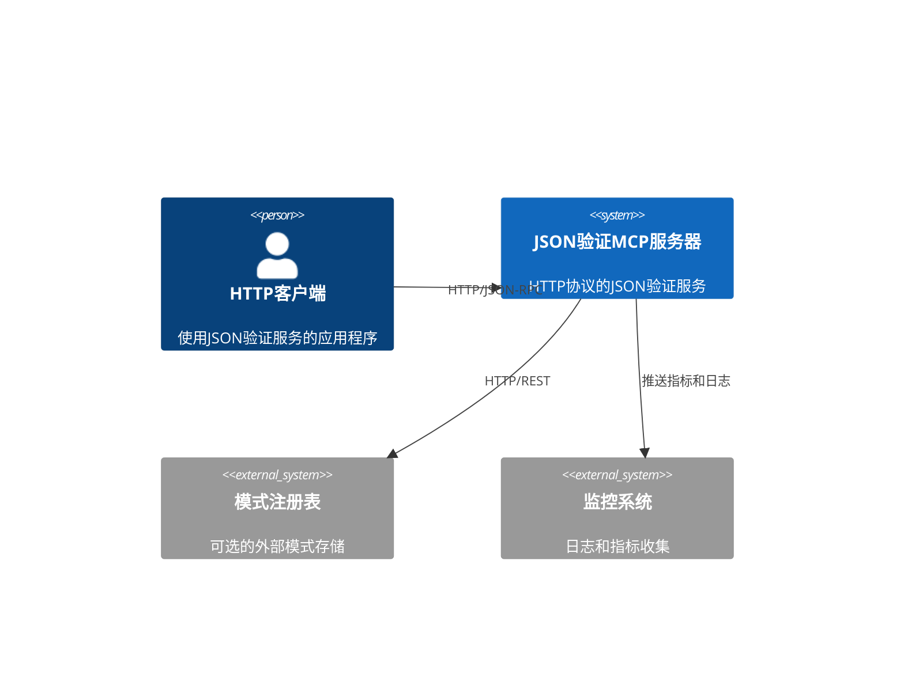
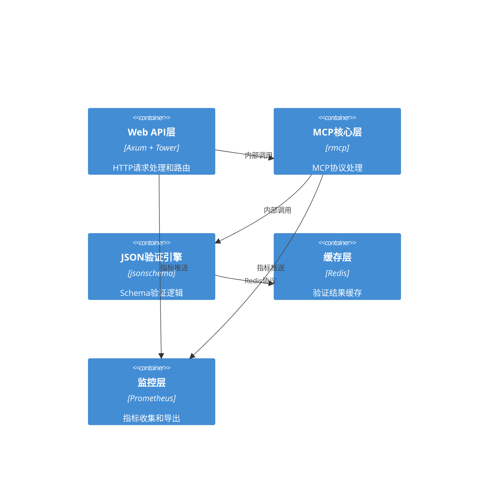
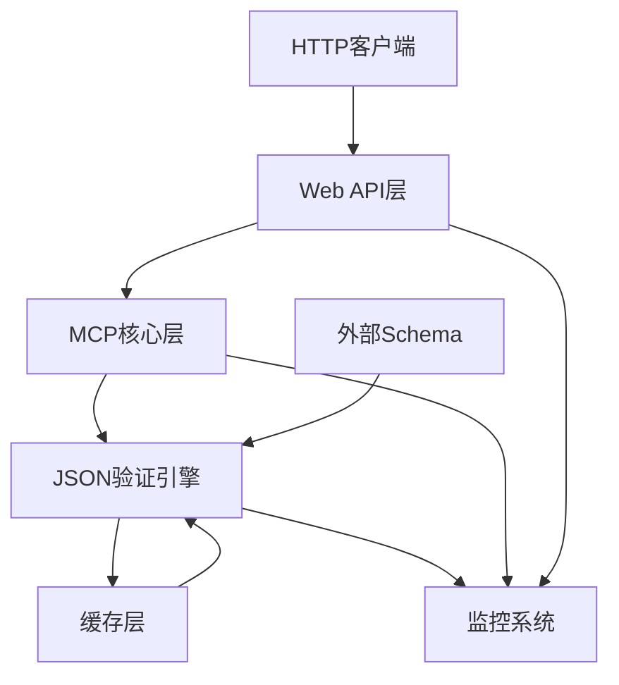
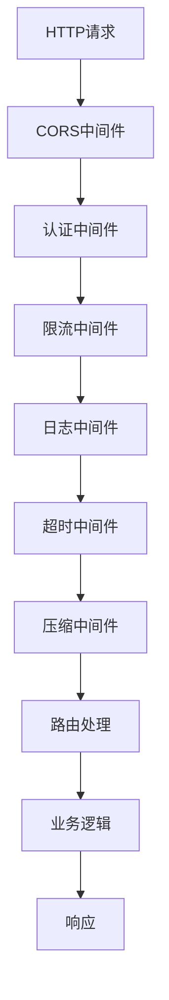

# JSON验证MCP服务器HTTP架构设计

## 执行摘要

本文档描述了将JSON验证MCP服务器从stdio协议转换为HTTP协议的完整系统架构设计。该设计保持了现有功能的完整性，同时提供了企业级的性能、安全性和可扩展性。

## 架构概述

### 系统上下文



### 容器架构



## 组件设计

### 1. Web API层 (HTTP Adapter)
**目的**: 处理HTTP请求，转换为MCP协议调用
**技术**: Axum + Tower + Tower-HTTP
**接口**: 
- 输入: HTTP请求 (JSON-RPC 2.0 over HTTP)
- 输出: HTTP响应 (JSON-RPC 2.0 over HTTP)
**依赖**: MCP核心层

**核心功能**:
- HTTP路由和中间件
- JSON-RPC请求/响应处理
- 认证和授权
- 请求限流和超时控制
- CORS和压缩支持

### 2. MCP核心层 (Protocol Handler)
**目的**: 实现MCP协议逻辑，处理工具调用
**技术**: rmcp crate
**接口**: 
- 输入: 标准化的MCP请求
- 输出: MCP响应
**依赖**: JSON验证引擎

**核心功能**:
- MCP协议实现
- 工具注册和调用
- 会话管理
- 错误处理和转换

### 3. JSON验证引擎 (Validation Core)
**目的**: 执行JSON Schema验证
**技术**: jsonschema crate
**接口**: 
- 输入: JSON数据和Schema
- 输出: 验证结果
**依赖**: 缓存层

**核心功能**:
- Schema编译和缓存
- JSON数据验证
- 错误消息生成
- 性能优化

### 4. 缓存层 (Cache Layer)
**目的**: 缓存验证结果和编译后的Schema
**技术**: Redis
**接口**: 
- 输入: 缓存键值对
- 输出: 缓存命中/未命中结果
**依赖**: Redis服务器

**核心功能**:
- Schema编译结果缓存
- 验证结果缓存
- 缓存过期和清理
- 分布式缓存支持

### 5. 监控层 (Monitoring Layer)
**目的**: 收集和导出系统指标
**技术**: Prometheus + OpenTelemetry
**接口**: 
- 输入: 系统指标和日志
- 输出: 格式化的监控数据
**依赖**: 监控系统

**核心功能**:
- 请求指标收集
- 性能指标监控
- 错误率统计
- 分布式追踪

## 数据架构

### 数据流图



### 数据模型

#### 请求模型
```rust
#[derive(Debug, Serialize, Deserialize)]
pub struct ValidationRequest {
    pub json_data: Value,
    pub schema: Value,
    pub options: ValidationOptions,
    pub cache_key: Option<String>,
}

#[derive(Debug, Serialize, Deserialize)]
pub struct ValidationOptions {
    pub strict_mode: bool,
    pub allow_additional_properties: bool,
    pub custom_formats: HashMap<String, String>,
}
```

#### 响应模型
```rust
#[derive(Debug, Serialize, Deserialize)]
pub struct ValidationResponse {
    pub valid: bool,
    pub errors: Vec<ValidationError>,
    pub warnings: Vec<ValidationWarning>,
    pub execution_time: u64,
    pub cache_hit: bool,
}

#[derive(Debug, Serialize, Deserialize)]
pub struct ValidationError {
    pub instance_path: String,
    pub schema_path: String,
    pub message: String,
    pub error_code: String,
}
```

## HTTP协议设计

### JSON-RPC over HTTP

#### 请求格式
```http
POST /rpc HTTP/1.1
Host: localhost:8080
Content-Type: application/json
Authorization: Bearer <token>

{
  "jsonrpc": "2.0",
  "method": "tools/call",
  "params": {
    "name": "validate_json",
    "arguments": {
      "json_data": {"name": "test"},
      "schema": {"type": "object"}
    }
  },
  "id": 1
}
```

#### 响应格式
```http
HTTP/1.1 200 OK
Content-Type: application/json

{
  "jsonrpc": "2.0",
  "result": {
    "valid": true,
    "errors": [],
    "warnings": [],
    "execution_time": 1250,
    "cache_hit": false
  },
  "id": 1
}
```

### API端点设计

#### 1. JSON-RPC端点
- **路径**: `/rpc`
- **方法**: POST
- **认证**: Bearer Token
- **限流**: 1000请求/分钟

#### 2. 健康检查端点
- **路径**: `/health`
- **方法**: GET
- **响应**: 系统健康状态

#### 3. 指标端点
- **路径**: `/metrics`
- **方法**: GET
- **格式**: Prometheus格式

#### 4. Schema管理端点
- **路径**: `/schemas/{id}`
- **方法**: GET/PUT/DELETE
- **功能**: Schema的CRUD操作

## 中间件架构

### 中间件栈


### 核心中间件

#### 1. 认证中间件
- **类型**: Bearer Token认证
- **功能**: 验证JWT或API密钥
- **配置**: 可配置的认证提供者

#### 2. 限流中间件
- **算法**: 令牌桶算法
- **配置**: 每分钟请求数限制
- **存储**: Redis分布式限流

#### 3. 日志中间件
- **格式**: 结构化JSON日志
- **字段**: 请求ID、时间戳、响应时间、状态码
- **输出**: 标准输出 + 文件

#### 4. 监控中间件
- **指标**: 请求计数、响应时间、错误率
- **导出**: Prometheus格式
- **追踪**: OpenTelemetry支持

## 缓存策略

### 缓存层次
1. **内存缓存**: 编译后的Schema (TTL: 1小时)
2. **Redis缓存**: 验证结果 (TTL: 30分钟)
3. **分布式缓存**: 跨实例共享 (TTL: 15分钟)

### 缓存键设计
```rust
// Schema缓存键
fn schema_cache_key(schema_hash: &str) -> String {
    format!("schema:{}", schema_hash)
}

// 验证结果缓存键
fn validation_cache_key(data_hash: &str, schema_hash: &str) -> String {
    format!("validation:{}:{}", data_hash, schema_hash)
}
```

## 安全架构

### 认证与授权
- **认证方法**: JWT Bearer Token
- **授权模型**: 基于角色的访问控制 (RBAC)
- **令牌生命周期**: 24小时，可刷新

### 安全措施
- [x] HTTPS强制加密
- [x] 输入验证和清理
- [x] SQL注入防护
- [x] XSS防护
- [x] CSRF防护
- [x] 请求限流
- [x] 密钥管理
- [x] 安全头设置

### 安全头
```http
Strict-Transport-Security: max-age=31536000; includeSubDomains
X-Content-Type-Options: nosniff
X-Frame-Options: DENY
X-XSS-Protection: 1; mode=block
Content-Security-Policy: default-src 'self'
```

## 性能优化策略

### 水平扩展
- **负载均衡**: Nginx或云负载均衡器
- **会话管理**: 无状态设计
- **数据库**: Redis集群
- **缓存**: 多级缓存策略

### 性能优化
- **CDN**: 静态资源加速
- **资源优化**: 响应压缩
- **数据库索引**: 优化的查询性能
- **连接池**: 数据库连接复用

### 关键性能指标
- **响应时间**: P95 < 100ms
- **吞吐量**: 10,000 RPS
- **错误率**: < 0.1%
- **可用性**: 99.9%

## 部署架构

### 环境配置
- **开发**: 本地Docker容器
- **测试**: Kubernetes集群
- **生产**: 多区域Kubernetes集群

### 部署策略
- **容器化**: Docker镜像
- **编排**: Kubernetes
- **健康检查**: 活动性和就绪性探针
- **滚动更新**: 零停机部署

### 配置管理
- **配置文件**: TOML格式
- **环境变量**: 敏感信息
- **配置中心**: Consul或etcd
- **热重载**: 配置更新无需重启

## 监控与可观察性

### 指标监控
- **应用指标**: 请求计数、响应时间、错误率
- **系统指标**: CPU、内存、磁盘、网络
- **业务指标**: 验证成功率、缓存命中率
- **自定义仪表板**: Grafana

### 日志管理
- **集中化日志**: ELK或Loki栈
- **日志聚合**: Fluentd或Logstash
- **日志保留**: 30天
- **结构化日志**: JSON格式

### 分布式追踪
- **追踪系统**: Jaeger或Zipkin
- **采样率**: 1%生产环境，100%测试环境
- **追踪上下文**: OpenTelemetry

### 告警配置
- **关键告警**: 服务不可用、错误率过高
- **警告阈值**: 响应时间过长、缓存命中率低
- **升级策略**: 基于严重性的通知
- **值班流程**: 轮换值班表

## 架构决策记录 (ADRs)

### ADR-001: 使用JSON-RPC over HTTP
**状态**: 已接受
**上下文**: 需要选择HTTP协议的RPC实现方式
**决策**: 使用JSON-RPC 2.0 over HTTP
**后果**: 
- 优点: 标准化协议，易于调试，广泛支持
- 缺点: 比gRPC性能略低
**考虑的替代方案**: REST API, gRPC, GraphQL

### ADR-002: 选择Axum作为Web框架
**状态**: 已接受
**上下文**: 需要选择Rust Web框架
**决策**: 使用Axum框架
**后果**:
- 优点: 高性能，基于Tower中间件，社区活跃
- 缺点: 相对较新，生态系统不如Actix成熟
**考虑的替代方案**: Actix Web, Warp, Rocket

### ADR-003: 多级缓存策略
**状态**: 已接受
**上下文**: 需要优化验证性能
**决策**: 实现内存+Redis+分布式三级缓存
**后果**:
- 优点: 显著提升性能，减少重复计算
- 缺点: 增加系统复杂性，需要处理缓存一致性
**考虑的替代方案**: 单一缓存层，无缓存

### ADR-004: 无状态服务设计
**状态**: 已接受
**上下文**: 确定服务状态管理策略
**决策**: 采用无状态设计，状态存储在外部
**后果**:
- 优点: 易于扩展，容错性好
- 缺点: 依赖外部存储，网络延迟
**考虑的替代方案**: 有状态服务，会话亲和性

## 技术风险与缓解

### 主要风险
1. **性能风险**: 大量JSON验证可能导致CPU密集
2. **内存风险**: 大Schema编译可能消耗大量内存
3. **安全风险**: JSON解析可能存在漏洞
4. **扩展性风险**: 缓存失效可能导致数据库压力

### 缓解策略
1. **性能风险**: 实施请求队列、限制并发数、优化算法
2. **内存风险**: 设置内存限制、监控内存使用、实施缓存策略
3. **安全风险**: 使用经过验证的库、定期更新依赖、输入验证
4. **扩展性风险**: 实施渐进式缓存失效、数据库连接池、监控

## 未来扩展

### 短期扩展 (3-6个月)
- [ ] Schema版本管理
- [ ] 验证结果历史记录
- [ ] 自定义验证规则
- [ ] 批量验证API

### 中期扩展 (6-12个月)
- [ ] GraphQL API
- [ ] WebSocket实时验证
- [ ] 插件系统
- [ ] 多租户支持

### 长期扩展 (12+个月)
- [ ] AI辅助验证
- [ ] 模式自动生成
- [ ] 跨数据中心同步
- [ ] 服务网格集成