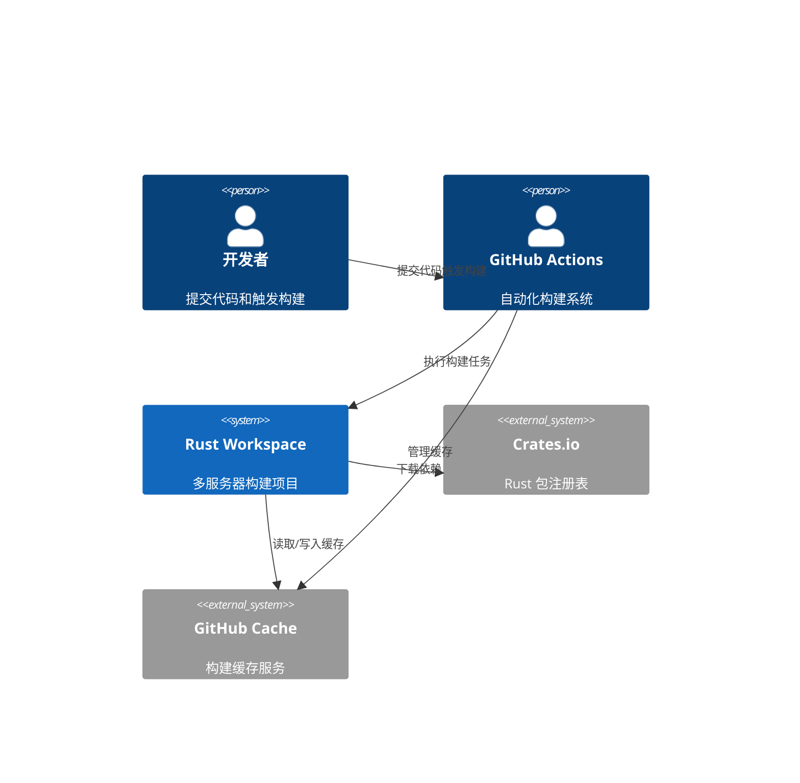
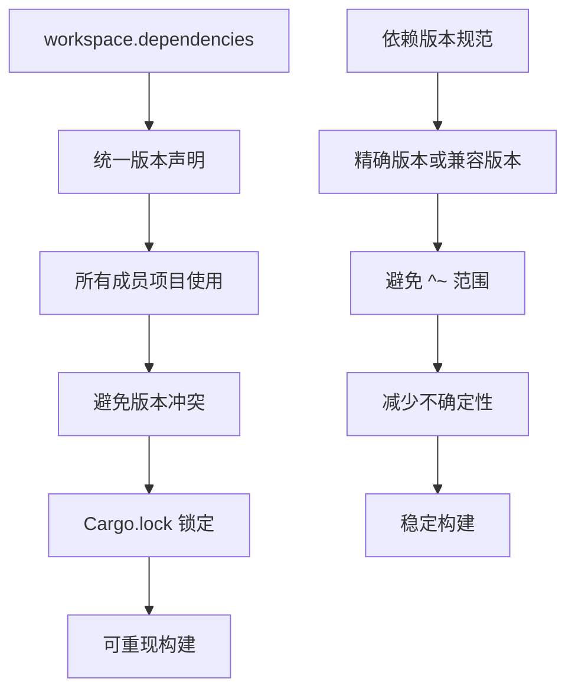
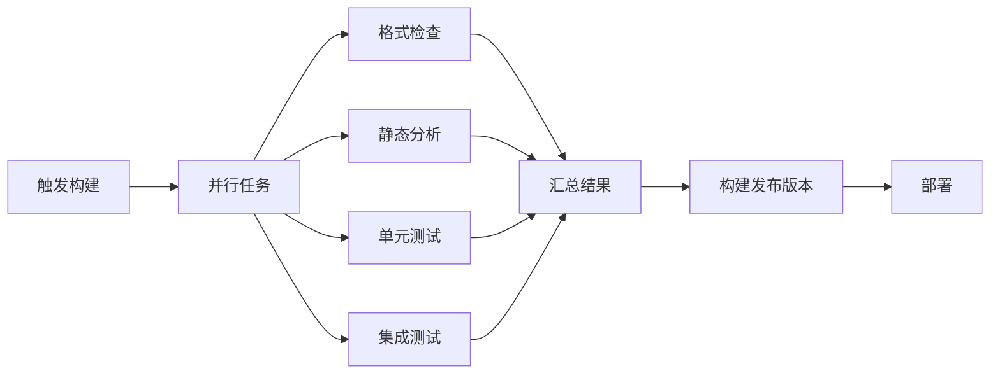
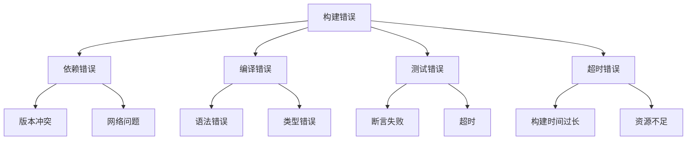
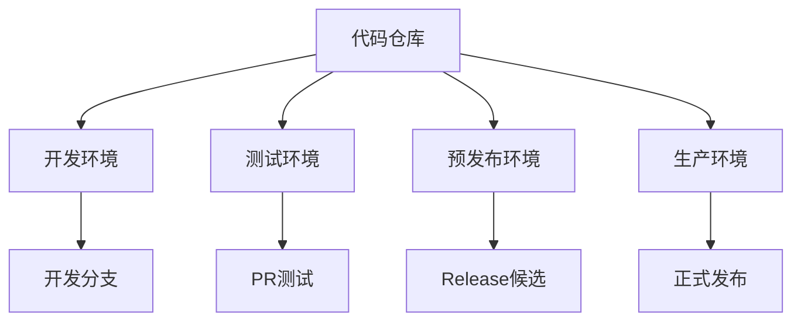
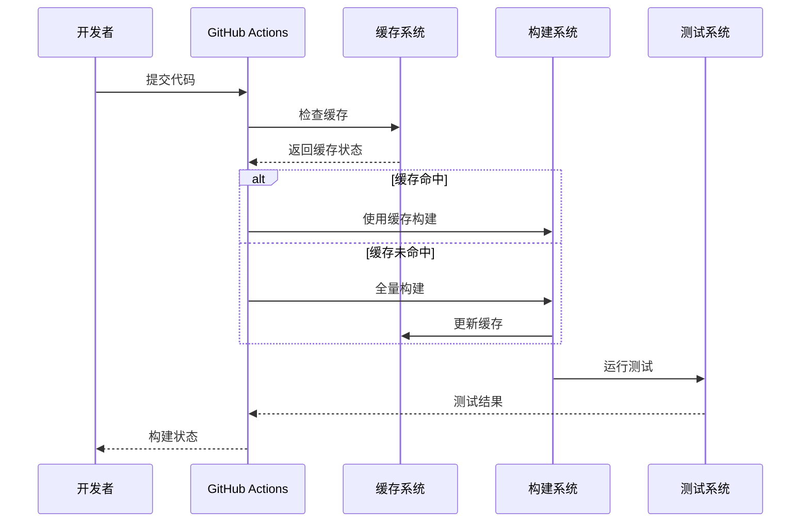

# GitHub Actions CI 构建问题修复架构设计

## 执行摘要

本文档详细设计了修复 Rust MCP Servers 项目 GitHub Actions CI 构建问题的系统架构。主要问题包括：依赖版本不一致、缓存配置问题、构建超时、工作流依赖复杂等。通过重新设计依赖管理、优化缓存策略、简化工作流流程和增强错误处理机制，实现稳定高效的 CI/CD 流程。

## 系统架构概览

### 系统上下文


### 构建流程架构
```mermaid
C4Container
    Container(ci_workflow, "CI 工作流", "GitHub Actions", "自动化构建流程")
    Container(dependency_mgr, "依赖管理器", "Cargo + Workspace", "统一依赖版本控制")
    Container(cache_system, "缓存系统", "GitHub Actions Cache", "构建结果缓存")
    Container(build_executor, "构建执行器", "Cargo", "代码编译和测试")
    Container(monitoring, "监控系统", "GitHub Actions Logs", "构建状态监控")
    
    Rel(ci_workflow, dependency_mgr, "版本检查和锁定")
    Rel(dependency_mgr, crate_registry, "下载依赖")
    Rel(dependency_mgr, cache_system, "缓存依赖")
    Rel(ci_workflow, build_executor, "执行构建")
    Rel(build_executor, cache_system, "缓存构建结果")
    Rel(build_executor, monitoring, "输出日志")
    Rel(ci_workflow, monitoring, "收集状态")
```

## 技术栈决策

### 构建工具栈
| 组件 | 选择版本 | 理由 |
|------|----------|------|
| Rust Toolchain | 1.80+ stable | 最新稳定版本，支持所有依赖 |
| Cargo | 1.80+ | 包管理器，支持 workspace |
| Cargo Workspace | 2.0 resolver | 统一依赖解析 |
| GitHub Actions | v4 | 最新版本，支持缓存优化 |
| Actions Cache | v4 | 改进的缓存性能 |

### 依赖管理策略


## 依赖管理架构

### Workspace 依赖统一化
```toml
# workspace.dependencies - 统一版本源
[workspace.dependencies]
# 核心运行时
tokio = { version = "1.40", features = ["full"] }
async-trait = "0.1.83"
futures = "0.3.31"

# 序列化
serde = { version = "1.0", features = ["derive"] }
serde_json = "1.0"

# HTTP 客户端和服务端
reqwest = { version = "0.12", features = ["json", "stream"] }
axum = "0.7"
tower = "0.5"
tower-http = { version = "0.5", features = ["cors", "trace", "compression-br", "timeout"] }

# MCP 协议
rmcp = { version = "0.5", features = ["transport-io", "transport-child-process", "macros"] }
```

### 依赖版本锁定策略
1. **精确版本控制**: 避免使用 `^` 和 `~` 范围
2. **workspace 统一**: 所有依赖在 workspace 级别声明
3. **Cargo.lock 提交**: 锁定版本并提交到仓库
4. **定期更新**: 建立依赖更新流程

## 构建流程优化

### 缓存策略设计
```yaml
# 多层缓存架构
cache_layers:
  # 1. 依赖缓存
  dependencies:
    paths:
      - ~/.cargo/registry
      - ~/.cargo/git
    key: cargo-deps-${{ hashFiles('**/Cargo.lock') }}
    
  # 2. 构建缓存
  build:
    paths:
      - target/
    key: cargo-build-${{ runner.os }}-${{ hashFiles('**/Cargo.lock') }}
    
  # 3. 工具缓存
  tools:
    paths:
      - ~/.rustup/toolchains/
    key: rust-toolchain-${{ hashFiles('rust-toolchain.toml') }}
```

### 并行构建优化


## 错误处理机制

### 构建错误分类


### 错误恢复策略
1. **自动重试**: 网络错误和临时问题
2. **回退版本**: 依赖版本冲突时回退
3. **增量构建**: 部分失败后继续构建
4. **详细日志**: 完整的错误上下文

## 监控和告警

### 构建指标监控
```yaml
metrics:
  build_time:
    description: "构建耗时"
    threshold: "30分钟"
    
  success_rate:
    description: "构建成功率"
    threshold: "95%"
    
  cache_hit_rate:
    description: "缓存命中率"
    threshold: "80%"
    
  test_coverage:
    description: "测试覆盖率"
    threshold: "70%"
```

### 告警机制
1. **构建失败**: 立即通知开发者
2. **性能下降**: 构建时间超过阈值
3. **缓存失效**: 缓存命中率过低
4. **安全漏洞**: 依赖安全问题

## 部署架构

### 环境隔离


### 发布流程
1. **自动化测试**: 所有测试通过
2. **安全扫描**: 无安全漏洞
3. **性能基准**: 性能回归检查
4. **逐步发布**: 金丝雀发布

## 数据流设计

### 构建数据流


## 安全架构

### 构建安全措施
```yaml
security_measures:
  # 依赖安全
  dependency_scanning:
    - cargo-audit
    - cargo-deny
    
  # 代码安全
  code_analysis:
    - clippy
    - rustfmt
    
  # 构建环境安全
  environment:
    - 容器隔离
    - 只读权限
    - 网络限制
```

### 安全策略
1. **依赖审计**: 定期安全扫描
2. **代码质量**: 静态分析强制通过
3. **权限最小化**: 构建过程最小权限
4. **密钥管理**: 安全的密钥存储和使用

## 性能优化

### 构建性能指标
```yaml
performance_targets:
  # 时间目标
  build_time:
    full_build: "< 10分钟"
    incremental_build: "< 2分钟"
    
  # 资源使用
  resource_usage:
    memory: "< 4GB"
    cpu: "< 4核心"
    
  # 缓存效果
  cache_efficiency:
    hit_rate: "> 80%"
    size: "< 2GB"
```

### 优化策略
1. **并行处理**: 最大化并行构建
2. **增量构建**: 只构建变更部分
3. **缓存优化**: 多层缓存策略
4. **资源限制**: 合理的资源分配

## 可维护性设计

### 配置管理
```yaml
configuration:
  # 集中配置
  centralized:
    - GitHub Actions 配置
    - 依赖版本配置
    - 构建参数配置
    
  # 环境特定
  environment_specific:
    - 开发环境
    - 测试环境
    - 生产环境
```

### 文档和标准化
1. **标准化流程**: 统一的构建流程
2. **详细文档**: 完整的操作文档
3. **版本管理**: 配置版本控制
4. **变更追踪**: 构建配置变更记录

## 架构决策记录

### ADR-001: 统一依赖管理策略
**状态**: 已接受
**上下文**: 各服务器项目依赖版本不一致导致构建失败
**决策**: 采用 workspace 级别统一依赖管理
**后果**: 
- ✅ 统一版本，避免冲突
- ✅ 简化依赖更新
- ❌ 需要重构现有项目

### ADR-002: 多层缓存策略
**状态**: 已接受
**上下文**: 单一缓存策略效果不佳，构建时间过长
**决策**: 实现依赖、构建、工具三层缓存
**后果**:
- ✅ 显著提升构建速度
- ✅ 减少网络请求
- ❌ 增加缓存管理复杂度

### ADR-003: 并行化工作流
**状态**: 已接受
**上下文**: 串行构建流程时间过长
**决策**: 将检查、测试、构建并行化
**后果**:
- ✅ 减少总构建时间
- ✅ 提高资源利用率
- ❌ 需要处理依赖关系

## 实施计划

### 第一阶段: 基础设施 (Week 1-2)
1. 更新 GitHub Actions 工作流
2. 实现统一依赖管理
3. 配置多层缓存策略

### 第二阶段: 流程优化 (Week 3-4)
1. 并行化构建流程
2. 实现错误处理机制
3. 添加监控和告警

### 第三阶段: 性能调优 (Week 5-6)
1. 性能基准测试
2. 缓存策略优化
3. 资源使用优化

### 第四阶段: 稳定性保障 (Week 7-8)
1. 压力测试
2. 故障恢复测试
3. 文档完善

## 质量保证

### 测试策略
```yaml
testing_strategy:
  # 单元测试
  unit_tests:
    coverage: "> 80%"
    parallel: true
    
  # 集成测试
  integration_tests:
    environment: "容器化"
    data_setup: "自动化"
    
  # 性能测试
  performance_tests:
    benchmarks: true
    regression_detection: true
```

### 质量门禁
1. **代码质量**: 所有检查必须通过
2. **测试覆盖**: 覆盖率达到目标
3. **性能指标**: 满足性能要求
4. **安全标准**: 无安全漏洞

## 风险评估

### 主要风险
1. **依赖兼容性**: 新版本可能不兼容
2. **缓存失效**: 缓存策略可能失效
3. **构建时间**: 优化效果可能不达预期
4. **资源限制**: GitHub Actions 资源限制

### 风险缓解
1. **渐进式升级**: 分阶段实施变更
2. **回滚机制**: 快速回滚到稳定版本
3. **监控告警**: 及时发现问题
4. **容量规划**: 合理的资源分配

## 总结

本架构设计通过统一依赖管理、优化缓存策略、并行化构建流程和增强错误处理，解决了当前 GitHub Actions CI 构建面临的主要问题。设计方案注重实用性、可维护性和扩展性，能够有效提升构建效率和稳定性。实施过程中采用渐进式方法，确保系统稳定性，同时建立完善的监控和告警机制，保障长期运行的可靠性。