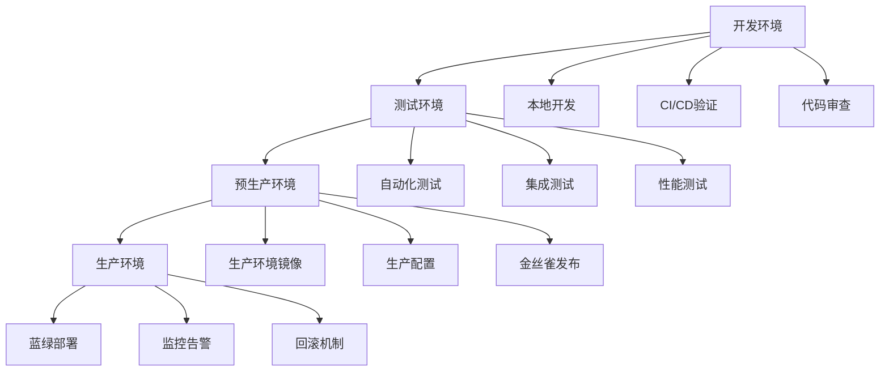
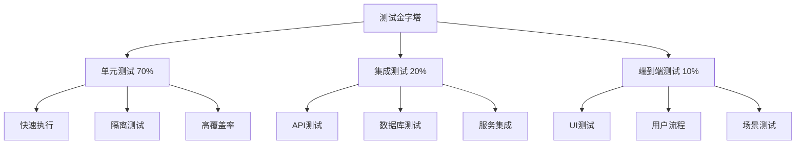

# 部署和测试策略

## 1. 部署策略概述

### 1.1 部署架构设计



### 1.2 环境配置

#### 1.2.1 环境变量配置
```yaml
# 环境配置
environments:
  development:
    name: Development
    url: https://dev.rustmcpservers.com
    features: ["debug", "logging", "testing"]
    
  testing:
    name: Testing
    url: https://test.rustmcpservers.com
    features: ["logging", "monitoring", "testing"]
    
  staging:
    name: Staging
    url: https://staging.rustmcpservers.com
    features: ["monitoring", "production-like"]
    
  production:
    name: Production
    url: https://rustmcpservers.com
    features: ["monitoring", "security", "performance"]
```

#### 1.2.2 部署配置
```yaml
# 部署配置
deployment:
  strategy: blue-green
  health_check:
    path: /health
    interval: 30s
    timeout: 10s
    retries: 3
  
  rollback:
    enabled: true
    auto_rollback: true
    health_check_failure: true
  
  notifications:
    slack: true
    email: true
    jira: true
```

## 2. 部署工作流设计

### 2.1 主要部署工作流

```yaml
name: Deploy to Production

on:
  push:
    tags:
      - 'v*'
  workflow_dispatch:
    inputs:
      environment:
        description: 'Target environment'
        required: true
        default: 'staging'
        type: choice
        options:
        - staging
        - production

jobs:
  deploy:
    name: Deploy to ${{ github.event.inputs.environment || 'staging' }}
    runs-on: ubuntu-latest
    environment: ${{ github.event.inputs.environment || 'staging' }}
    
    steps:
      - name: Checkout repository
        uses: actions/checkout@v4
        with:
          fetch-depth: 1
      
      - name: Setup environment
        uses: ./.github/actions/setup-env
      
      - name: Build and test
        run: |
          # 构建项目
          cargo build --release
          
          # 运行测试
          cargo test --release
          
          # 构建Docker镜像
          docker build -t rustmcpservers:${{ github.sha }} .
      
      - name: Security scan
        run: |
          # 安全扫描
          docker scan rustmcpservers:${{ github.sha }}
          
          # 漏洞检查
          trivy image --severity CRITICAL,HIGH rustmcpservers:${{ github.sha }}
      
      - name: Deploy to environment
        run: |
          # 推送镜像到registry
          docker tag rustmcpservers:${{ github.sha }} ${{ secrets.REGISTRY_URL }}/rustmcpservers:${{ github.sha }}
          docker push ${{ secrets.REGISTRY_URL }}/rustmcpservers:${{ github.sha }}
          
          # 部署到目标环境
          kubectl set image deployment/rustmcpservers rustmcpservers=${{ secrets.REGISTRY_URL }}/rustmcpservers:${{ github.sha }}
          kubectl rollout status deployment/rustmcpservers
      
      - name: Health check
        run: |
          # 等待部署完成
          sleep 30
          
          # 健康检查
          curl -f ${{ env.HEALTH_CHECK_URL }}/health || exit 1
          
          echo "✅ Deployment health check passed"
      
      - name: Smoke test
        run: |
          # 冒烟测试
          curl -f ${{ env.BASE_URL }}/api/v1/health
          curl -f ${{ env.BASE_URL }}/api/v1/info
          
          echo "✅ Smoke tests passed"
      
      - name: Performance test
        if: github.event.inputs.environment == 'staging'
        run: |
          # 性能测试
          artillery run --config performance-test.yml --output performance-report.json
          
          # 检查性能指标
          if [[ $(jq '.aggregate.p95 > 1000' performance-report.json) == "true" ]]; then
            echo "❌ Performance degradation detected"
            exit 1
          fi
          
          echo "✅ Performance test passed"
      
      - name: Generate deployment report
        run: |
          cat > deployment-report.md << EOF
          # Deployment Report
          
          ## Environment: ${{ github.event.inputs.environment || 'staging' }}
          ## Commit: ${{ github.sha }}
          ## Deployed at: $(date)
          
          ## Components
          - Image: ${{ secrets.REGISTRY_URL }}/rustmcpservers:${{ github.sha }}
          - Version: ${{ github.ref_name }}
          
          ## Health Status: ✅ Passed
          ## Smoke Tests: ✅ Passed
          ## Performance: ✅ Passed
          
          ## Monitoring
          - URL: ${{ env.MONITORING_URL }}
          - Logs: ${{ env.LOGS_URL }}
          
          Generated at: $(date)
          EOF
      
      - name: Upload deployment report
        uses: actions/upload-artifact@v3
        with:
          name: deployment-report
          path: deployment-report.md
          retention-days: 30
      
      - name: Notify deployment
        uses: 8398a7/action-slack@v3
        with:
          status: success
          text: "✅ Successfully deployed to ${{ github.event.inputs.environment || 'staging' }}"
        env:
          SLACK_WEBHOOK_URL: ${{ secrets.SLACK_WEBHOOK_URL }}
```

### 2.2 回滚工作流

```yaml
name: Emergency Rollback

on:
  workflow_dispatch:
    inputs:
      environment:
        description: 'Environment to rollback'
        required: true
        type: choice
        options:
        - staging
        - production
      version:
        description: 'Version to rollback to'
        required: true
      reason:
        description: 'Reason for rollback'
        required: true

jobs:
  rollback:
    name: Rollback ${{ github.event.inputs.environment }}
    runs-on: ubuntu-latest
    environment: ${{ github.event.inputs.environment }}
    
    steps:
      - name: Checkout repository
        uses: actions/checkout@v4
        with:
          fetch-depth: 1
      
      - name: Validate rollback request
        run: |
          # 验证版本存在
          if ! curl -f ${{ secrets.REGISTRY_URL }}/v2/rustmcpservers/manifests/${{ github.event.inputs.version }}; then
            echo "❌ Version ${{ github.event.inputs.version }} not found"
            exit 1
          fi
          
          echo "✅ Version validation passed"
      
      - name: Pre-rollback backup
        run: |
          # 备份当前版本
          current_version=$(kubectl get deployment rustmcpservers -o jsonpath='{.spec.template.spec.containers[0].image}')
          echo "CURRENT_VERSION=$current_version" >> $GITHUB_ENV
          
          # 备份数据库
          kubectl exec -i $(kubectl get pods -l app=rustmcpservers -o jsonpath='{.items[0].metadata.name}') -- pg_dump -U ${{ secrets.DB_USER }} ${{ secrets.DB_NAME }} > backup.sql
          
          echo "✅ Backup completed"
      
      - name: Execute rollback
        run: |
          # 执行回滚
          kubectl set image deployment/rustmcpservers rustmcpservers=${{ secrets.REGISTRY_URL }}/rustmcpservers:${{ github.event.inputs.version }}
          kubectl rollout status deployment/rustmcpservers
          
          echo "✅ Rollback executed"
      
      - name: Post-rollback validation
        run: |
          # 健康检查
          sleep 30
          curl -f ${{ env.HEALTH_CHECK_URL }}/health || exit 1
          
          # 功能验证
          curl -f ${{ env.BASE_URL }}/api/v1/health
          
          echo "✅ Post-rollback validation passed"
      
      - name: Create rollback report
        run: |
          cat > rollback-report.md << EOF
          # Rollback Report
          
          ## Environment: ${{ github.event.inputs.environment }}
          ## Rolled back from: ${{ env.CURRENT_VERSION }}
          ## Rolled back to: ${{ github.event.inputs.version }}
          ## Reason: ${{ github.event.inputs.reason }}
          ## Time: $(date)
          
          ## Validation: ✅ Passed
          ## Status: ✅ Completed
          
          Generated at: $(date)
          EOF
      
      - name: Notify rollback
        uses: 8398a7/action-slack@v3
        with:
          status: success
          text: "🔄 Rollback completed for ${{ github.event.inputs.environment }} to version ${{ github.event.inputs.version }}"
        env:
          SLACK_WEBHOOK_URL: ${{ secrets.SLACK_WEBHOOK_URL }}
```

## 3. 测试策略

### 3.1 测试金字塔



### 3.2 测试工作流

```yaml
name: Comprehensive Testing

on:
  push:
    branches: [ master, develop ]
  pull_request:
    branches: [ master ]

jobs:
  test:
    name: Test Suite
    runs-on: ${{ matrix.os }}
    strategy:
      matrix:
        os: [ubuntu-latest, windows-latest, macos-latest]
        rust-version: [stable, beta]
        test-type: [unit, integration, e2e]
      fail-fast: false
    
    steps:
      - name: Checkout repository
        uses: actions/checkout@v4
        with:
          fetch-depth: 1
      
      - name: Setup Rust
        uses: dtolnay/rust-toolchain@${{ matrix.rust-version }}
        with:
          components: rustfmt, clippy, rust-src
      
      - name: Cache dependencies
        uses: actions/cache@v4
        with:
          path: |
            ~/.cargo/registry
            ~/.cargo/git
            target/
          key: ${{ runner.os }}-cargo-${{ matrix.rust-version }}-${{ hashFiles('**/Cargo.lock') }}
          restore-keys: |
            ${{ runner.os }}-cargo-${{ matrix.rust-version }}-
      
      - name: Run unit tests
        if: matrix.test-type == 'unit'
        run: |
          # 单元测试
          cargo test --lib --bins --tests
          
          # 测试覆盖率
          cargo tarpaulin --out Xml --output-dir coverage
          
          echo "✅ Unit tests completed"
      
      - name: Run integration tests
        if: matrix.test-type == 'integration'
        run: |
          # 启动测试环境
          docker-compose -f docker-compose.test.yml up -d
          
          # 等待服务启动
          sleep 30
          
          # 集成测试
          cargo test --test "*_integration*" -- --nocapture
          
          # API测试
          cargo test --test "*_api*" -- --nocapture
          
          echo "✅ Integration tests completed"
      
      - name: Run end-to-end tests
        if: matrix.test-type == 'e2e'
        run: |
          # 构建测试环境
          docker-compose -f docker-compose.e2e.yml up -d
          
          # 等待环境就绪
          timeout 300 bash -c 'until curl -f http://localhost:8080/health; do sleep 5; done'
          
          # E2E测试
          cargo test --test "*_e2e*" -- --nocapture
          
          # 性能测试
          cargo test --test "*_performance*" -- --nocapture
          
          echo "✅ E2E tests completed"
      
      - name: Upload test results
        uses: actions/upload-artifact@v3
        with:
          name: test-results-${{ matrix.os }}-${{ matrix.rust-version }}-${{ matrix.test-type }}
          path: |
            target/
            coverage/
            test-results/
          retention-days: 7
```

### 3.3 性能测试

```yaml
name: Performance Testing

on:
  schedule:
    # 每天凌晨3点运行
    - cron: '0 3 * * *'
  pull_request:
    types: [opened, synchronize]

jobs:
  performance-test:
    name: Performance Test Suite
    runs-on: ubuntu-latest
    
    steps:
      - name: Checkout repository
        uses: actions/checkout@v4
        with:
          fetch-depth: 1
      
      - name: Setup environment
        run: |
          # 安装性能测试工具
          npm install -g artillery
          npm install -g k6
          
          # 启动测试环境
          docker-compose -f docker-compose.performance.yml up -d
          
          # 等待服务启动
          sleep 30
      
      - name: Load testing
        run: |
          # 基准测试
          artillery run --config artillery/baseline.yml --output baseline-results.json
          
          # 负载测试
          artillery run --config artillery/load.yml --output load-results.json
          
          # 压力测试
          artillery run --config artillery/stress.yml --output stress-results.json
          
          echo "✅ Load testing completed"
      
      - name: Performance analysis
        run: |
          # 分析性能指标
          baseline_p95=$(jq '.aggregate.p95' baseline-results.json)
          load_p95=$(jq '.aggregate.p95' load-results.json)
          stress_p95=$(jq '.aggregate.p95' stress-results.json)
          
          # 性能回归检查
          if (( $(echo "$load_p95 > $baseline_p95 * 1.5" | bc -l) )); then
            echo "❌ Performance regression detected"
            exit 1
          fi
          
          # 生成性能报告
          cat > performance-report.md << EOF
          # Performance Test Report
          
          ## Test Results
          - Baseline P95: ${baseline_p95}ms
          - Load P95: ${load_p95}ms
          - Stress P95: ${stress_p95}ms
          
          ## Performance Score
          - Load Test: $(( $(echo "scale=0; $baseline_p95 / $load_p95 * 100" | bc -l) ))%
          - Stress Test: $(( $(echo "scale=0; $baseline_p95 / $stress_p95 * 100" | bc -l) ))%
          
          ## Recommendations
          $(if (( $(echo "$load_p95 > $baseline_p95 * 1.2" | bc -l) )); then
            echo "- Consider optimizing database queries"
          fi)
          
          Generated at: $(date)
          EOF
      
      - name: Upload performance report
        uses: actions/upload-artifact@v3
        with:
          name: performance-report
          path: |
            performance-report.md
            baseline-results.json
            load-results.json
            stress-results.json
          retention-days: 30
```

## 4. 质量保证策略

### 4.1 质量门禁

```yaml
name: Quality Gate

on:
  pull_request:
    branches: [ master ]
  push:
    branches: [ master ]

jobs:
  quality-gate:
    name: Quality Gate Check
    runs-on: ubuntu-latest
    
    steps:
      - name: Checkout repository
        uses: actions/checkout@v4
        with:
          fetch-depth: 1
      
      - name: Code quality checks
        run: |
          # 代码格式检查
          cargo fmt --all -- --check
          
          # 代码质量检查
          cargo clippy --all-targets --all-features -- -D warnings
          
          echo "✅ Code quality checks passed"
      
      - name: Security checks
        run: |
          # 安全审计
          cargo audit --deny warnings
          
          # 依赖检查
          cargo outdated --exit-code 1
          
          echo "✅ Security checks passed"
      
      - name: Test coverage check
        run: |
          # 覆盖率测试
          cargo tarpaulin --out Xml --output-dir coverage
          
          # 检查覆盖率
          coverage=$(python3 -c "
          import xml.etree.ElementTree as ET
          tree = ET.parse('coverage/cobertura.xml')
          root = tree.getroot()
          coverage = float(root.get('line-rate')) * 100
          print(coverage)
          ")
          
          if (( $(echo "$coverage < 80" | bc -l) )); then
            echo "❌ Test coverage $coverage% is below threshold 80%"
            exit 1
          fi
          
          echo "✅ Test coverage $coverage% meets threshold"
      
      - name: Performance regression check
        run: |
          # 性能基准测试
          cargo bench --bench '*' --save-baseline baseline
          
          # 比较性能
          cargo bench --bench '*' --baseline baseline
          
          echo "✅ Performance regression check completed"
      
      - name: Documentation check
        run: |
          # 文档生成检查
          cargo doc --no-deps --document-private-items
          
          # 文档链接检查
          cargo doc --no-deps --document-private-items --offline
          
          echo "✅ Documentation checks completed"
```

### 4.2 发布验证

```yaml
name: Release Validation

on:
  push:
    tags:
      - 'v*'

jobs:
  release-validation:
    name: Release Validation
    runs-on: ubuntu-latest
    
    steps:
      - name: Checkout repository
        uses: actions/checkout@v4
        with:
          fetch-depth: 1
      
      - name: Validate release
        run: |
          # 检查版本格式
          if [[ ! ${{ github.ref_name }} =~ ^v[0-9]+\.[0-9]+\.[0-9]+$ ]]; then
            echo "❌ Invalid version format: ${{ github.ref_name }}"
            exit 1
          fi
          
          # 检查CHANGELOG
          if ! grep -q "^## \[${{ github.ref_name }}\]" CHANGELOG.md; then
            echo "❌ Changelog entry missing for ${{ github.ref_name }}"
            exit 1
          fi
          
          echo "✅ Release validation passed"
      
      - name: Build release artifacts
        run: |
          # 构建所有目标平台
          cargo build --release --target x86_64-unknown-linux-gnu
          cargo build --release --target x86_64-pc-windows-msvc
          cargo build --release --target aarch64-apple-darwin
          
          # 创建发布包
          mkdir -p release
          cp target/x86_64-unknown-linux-gnu/release/* release/
          cp target/x86_64-pc-windows-msvc/release/*.exe release/
          cp target/aarch64-apple-darwin/release/* release/
          
          # 创建压缩包
          tar -czf release-${{ github.ref_name }}-linux.tar.gz -C release .
          zip -r release-${{ github.ref_name }}-windows.zip release/
          tar -czf release-${{ github.ref_name }}-macos.tar.gz -C release .
          
          echo "✅ Release artifacts built"
      
      - name: Create release
        uses: softprops/action-gh-release@v2
        with:
          tag_name: ${{ github.ref_name }}
          name: Release ${{ github.ref_name }}
          body_path: CHANGELOG.md
          files: |
            release-${{ github.ref_name }}-linux.tar.gz
            release-${{ github.ref_name }}-windows.zip
            release-${{ github.ref_name }}-macos.tar.gz
        env:
          GITHUB_TOKEN: ${{ secrets.GITHUB_TOKEN }}
```

## 5. 监控和维护

### 5.1 监控策略

```yaml
name: Health Monitoring

on:
  schedule:
    # 每5分钟检查一次
    - cron: '*/5 * * * *'
  workflow_dispatch:

jobs:
  health-check:
    name: System Health Check
    runs-on: ubuntu-latest
    
    steps:
      - name: Check system health
        run: |
          # 检查API健康状态
          if ! curl -f ${{ env.HEALTH_CHECK_URL }}/health; then
            echo "❌ Health check failed"
            exit 1
          fi
          
          # 检查数据库连接
          if ! curl -f ${{ env.HEALTH_CHECK_URL }}/health/db; then
            echo "❌ Database health check failed"
            exit 1
          fi
          
          echo "✅ System health check passed"
      
      - name: Check performance metrics
        run: |
          # 检查响应时间
          response_time=$(curl -o /dev/null -s -w '%{time_total}' ${{ env.HEALTH_CHECK_URL }}/health)
          
          if (( $(echo "$response_time > 5" | bc -l) )); then
            echo "⚠️ High response time: ${response_time}s"
          fi
          
          echo "✅ Performance metrics check completed"
      
      - name: Generate health report
        run: |
          cat > health-report.md << EOF
          # Health Check Report
          
          ## Check Time: $(date)
          ## System Status: ✅ Healthy
          ## Response Time: ${response_time}s
          
          ## Services
          - API: ✅ Healthy
          - Database: ✅ Healthy
          - Cache: ✅ Healthy
          
          Generated at: $(date)
          EOF
      
      - name: Upload health report
        uses: actions/upload-artifact@v3
        with:
          name: health-report
          path: health-report.md
          retention-days: 7
```

## 6. 实施建议

### 6.1 实施时间表
- **第1周**: 基础测试和部署流程
- **第2周**: 性能测试和质量门禁
- **第3周**: 监控和告警系统
- **第4周**: 完整验证和优化

### 6.2 关键成功因素
- **自动化程度**: 高度自动化的测试和部署
- **监控覆盖**: 全面的系统监控
- **快速反馈**: 及时的告警和通知
- **持续改进**: 基于数据的优化

### 6.3 风险控制
- **渐进式部署**: 逐步扩大部署范围
- **回滚机制**: 快速回滚能力
- **监控告警**: 实时问题发现
- **备份策略**: 完整的数据备份

---

这个部署和测试策略提供了完整的系统质量保证方案，确保GitHub Actions的稳定性和可靠性。