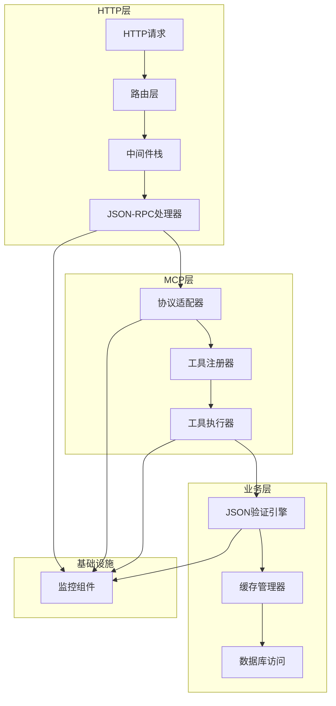

# HTTP协议MCP服务器实现模式

## 概述

本文档详细描述了HTTP协议MCP服务器的具体实现模式，包括架构设计、核心组件、关键实现细节和最佳实践。

## 实现架构

### 整体架构模式



### 核心组件设计

#### 1. HTTP服务器组件

**文件结构**:
```
src/
├── http/
│   ├── mod.rs              # HTTP模块导出
│   ├── server.rs           # HTTP服务器配置和启动
│   ├── router.rs           # 路由定义
│   ├── middleware.rs       # 中间件栈
│   ├── handlers.rs         # 请求处理器
│   └── json_rpc.rs         # JSON-RPC协议处理
└── ...
```

**server.rs 实现**:
```rust
use axum::{routing::{get, post}, Router, http::HeaderMap};
use tower_http::{cors::CorsLayer, trace::TraceLayer};
use std::net::SocketAddr;

pub struct HttpServer {
    app: Router,
    addr: SocketAddr,
}

impl HttpServer {
    pub fn new(config: &HttpConfig) -> Self {
        let app = Router::new()
            .route("/rpc", post(handlers::handle_rpc))
            .route("/health", get(handlers::handle_health))
            .route("/metrics", get(handlers::handle_metrics))
            .layer(middleware_stack(config))
            .with_state(AppState::new());
            
        Self {
            app,
            addr: config.listen_addr,
        }
    }
    
    pub async fn run(self) -> Result<(), Box<dyn std::error::Error>> {
        tracing::info!("Starting HTTP server on {}", self.addr);
        let listener = tokio::net::TcpListener::bind(self.addr).await?;
        axum::serve(listener, self.app).await?;
        Ok(())
    }
}

fn middleware_stack(config: &HttpConfig) -> tower::ServiceBuilder<axum::body::Body> {
    tower::ServiceBuilder::new()
        .layer(TraceLayer::new_for_http())
        .layer(CorsLayer::permissive())
        .layer(tower_http::compression::CompressionLayer::new())
        .layer(tower_http::timeout::TimeoutLayer::new(
            std::time::Duration::from_secs(30),
        ))
}
```

#### 2. JSON-RPC处理器

**json_rpc.rs 实现**:
```rust
use serde::{Deserialize, Serialize};
use std::collections::HashMap;
use crate::mcp::McpProtocolHandler;

#[derive(Debug, Serialize, Deserialize)]
pub struct JsonRpcRequest {
    pub jsonrpc: String,
    pub method: String,
    pub params: Option<serde_json::Value>,
    pub id: serde_json::Value,
}

#[derive(Debug, Serialize, Deserialize)]
pub struct JsonRpcResponse {
    pub jsonrpc: String,
    pub result: Option<serde_json::Value>,
    pub error: Option<JsonRpcError>,
    pub id: serde_json::Value,
}

#[derive(Debug, Serialize, Deserialize)]
pub struct JsonRpcError {
    pub code: i32,
    pub message: String,
    pub data: Option<serde_json::Value>,
}

pub struct JsonRpcHandler {
    mcp_handler: McpProtocolHandler,
}

impl JsonRpcHandler {
    pub fn new(mcp_handler: McpProtocolHandler) -> Self {
        Self { mcp_handler }
    }
    
    pub async fn handle_request(&self, request: JsonRpcRequest) -> JsonRpcResponse {
        match request.method.as_str() {
            "tools/call" => self.handle_tools_call(request).await,
            "tools/list" => self.handle_tools_list(request).await,
            _ => self.handle_unknown_method(request),
        }
    }
    
    async fn handle_tools_call(&self, request: JsonRpcRequest) -> JsonRpcResponse {
        let params = match request.params {
            Some(params) => params,
            None => return self.invalid_params_error(request.id, "Missing parameters"),
        };
        
        match self.mcp_handler.handle_tool_call(params).await {
            Ok(result) => JsonRpcResponse {
                jsonrpc: "2.0".to_string(),
                result: Some(result),
                error: None,
                id: request.id,
            },
            Err(error) => JsonRpcResponse {
                jsonrpc: "2.0".to_string(),
                result: None,
                error: Some(JsonRpcError {
                    code: -32000,
                    message: error.to_string(),
                    data: None,
                }),
                id: request.id,
            },
        }
    }
    
    fn invalid_params_error(&self, id: serde_json::Value, message: &str) -> JsonRpcResponse {
        JsonRpcResponse {
            jsonrpc: "2.0".to_string(),
            result: None,
            error: Some(JsonRpcError {
                code: -32602,
                message: message.to_string(),
                data: None,
            }),
            id,
        }
    }
}
```

#### 3. MCP协议适配器

**mcp/mod.rs 实现**:
```rust
use rmcp::{McpServer, Tool, ToolCallParams};
use serde_json::Value;
use crate::validation::JsonValidator;
use crate::cache::CacheManager;

pub struct McpProtocolHandler {
    validator: JsonValidator,
    cache: CacheManager,
    tools: HashMap<String, Tool>,
}

impl McpProtocolHandler {
    pub fn new(validator: JsonValidator, cache: CacheManager) -> Self {
        let mut handler = Self {
            validator,
            cache,
            tools: HashMap::new(),
        };
        handler.register_tools();
        handler
    }
    
    fn register_tools(&mut self) {
        self.tools.insert("validate_json".to_string(), Tool {
            name: "validate_json".to_string(),
            description: "Validate JSON data against a schema".to_string(),
            input_schema: serde_json::json!({
                "type": "object",
                "properties": {
                    "json_data": {"type": "object"},
                    "schema": {"type": "object"},
                    "options": {"type": "object"}
                },
                "required": ["json_data", "schema"]
            }),
        });
        
        self.tools.insert("validate_batch".to_string(), Tool {
            name: "validate_batch".to_string(),
            description: "Validate multiple JSON documents".to_string(),
            input_schema: serde_json::json!({
                "type": "object",
                "properties": {
                    "validations": {
                        "type": "array",
                        "items": {
                            "type": "object",
                            "properties": {
                                "json_data": {"type": "object"},
                                "schema": {"type": "object"}
                            },
                            "required": ["json_data", "schema"]
                        }
                    }
                },
                "required": ["validations"]
            }),
        });
    }
    
    pub async fn handle_tool_call(&self, params: Value) -> Result<Value, Box<dyn std::error::Error>> {
        let tool_call: ToolCallParams = serde_json::from_value(params)?;
        
        match tool_call.name.as_str() {
            "validate_json" => self.validate_single(tool_call.arguments).await,
            "validate_batch" => self.validate_batch(tool_call.arguments).await,
            _ => Err(format!("Unknown tool: {}", tool_call.name).into()),
        }
    }
    
    async fn validate_single(&self, args: Value) -> Result<Value, Box<dyn std::error::Error>> {
        let validation_request: ValidationRequest = serde_json::from_value(args)?;
        
        // 检查缓存
        let cache_key = self.generate_cache_key(&validation_request);
        if let Some(cached_result) = self.cache.get(&cache_key).await {
            return Ok(cached_result);
        }
        
        // 执行验证
        let result = self.validator.validate(validation_request).await?;
        
        // 缓存结果
        self.cache.set(&cache_key, result.clone()).await?;
        
        Ok(result)
    }
    
    async fn validate_batch(&self, args: Value) -> Result<Value, Box<dyn std::error::Error>> {
        let batch_request: BatchValidationRequest = serde_json::from_value(args)?;
        let mut results = Vec::new();
        
        for validation in batch_request.validations {
            let result = self.validate_single(serde_json::to_value(validation)?).await?;
            results.push(result);
        }
        
        Ok(serde_json::json!({
            "results": results,
            "total_count": results.len()
        }))
    }
    
    fn generate_cache_key(&self, request: &ValidationRequest) -> String {
        use std::collections::hash_map::DefaultHasher;
        use std::hash::{Hash, Hasher};
        
        let mut hasher = DefaultHasher::new();
        request.json_data.hash(&mut hasher);
        request.schema.hash(&mut hasher);
        format!("validation:{:x}", hasher.finish())
    }
}
```

#### 4. 验证引擎

**validation/mod.rs 实现**:
```rust
use jsonschema::{JSONSchema, ValidationError};
use serde_json::Value;
use std::collections::HashMap;
use std::sync::Arc;
use tokio::sync::RwLock;

pub struct JsonValidator {
    schema_cache: Arc<RwLock<HashMap<String, Arc<JSONSchema>>>>,
}

impl JsonValidator {
    pub fn new() -> Self {
        Self {
            schema_cache: Arc::new(RwLock::new(HashMap::new())),
        }
    }
    
    pub async fn validate(&self, request: ValidationRequest) -> Result<Value, Box<dyn std::error::Error>> {
        let start_time = std::time::Instant::now();
        
        // 编译或获取缓存的Schema
        let schema = self.get_or_compile_schema(&request.schema).await?;
        
        // 执行验证
        let validation_result = schema.validate(&request.json_data);
        
        let execution_time = start_time.elapsed().as_millis() as u64;
        
        match validation_result {
            Ok(_) => Ok(serde_json::json!({
                "valid": true,
                "errors": [],
                "warnings": [],
                "execution_time": execution_time
            })),
            Err(errors) => {
                let error_list: Vec<ValidationErrorInfo> = errors
                    .into_iter()
                    .map(|e| ValidationErrorInfo::from(e))
                    .collect();
                
                Ok(serde_json::json!({
                    "valid": false,
                    "errors": error_list,
                    "warnings": [],
                    "execution_time": execution_time
                }))
            }
        }
    }
    
    async fn get_or_compile_schema(&self, schema_def: &Value) -> Result<Arc<JSONSchema>, Box<dyn std::error::Error>> {
        let schema_key = self.generate_schema_key(schema_def);
        
        {
            let cache = self.schema_cache.read().await;
            if let Some(cached_schema) = cache.get(&schema_key) {
                return Ok(cached_schema.clone());
            }
        }
        
        // 编译新Schema
        let compiled_schema = JSONSchema::compile(schema_def)?;
        let arc_schema = Arc::new(compiled_schema);
        
        // 缓存Schema
        {
            let mut cache = self.schema_cache.write().await;
            cache.insert(schema_key, arc_schema.clone());
        }
        
        Ok(arc_schema)
    }
    
    fn generate_schema_key(&self, schema: &Value) -> String {
        use std::collections::hash_map::DefaultHasher;
        use std::hash::{Hash, Hasher};
        
        let mut hasher = DefaultHasher::new();
        schema.hash(&mut hasher);
        format!("schema:{:x}", hasher.finish())
    }
}

#[derive(Debug, Serialize, Deserialize)]
pub struct ValidationRequest {
    pub json_data: Value,
    pub schema: Value,
    pub options: ValidationOptions,
}

#[derive(Debug, Serialize, Deserialize)]
pub struct ValidationOptions {
    pub strict_mode: bool,
    pub allow_additional_properties: bool,
    pub custom_formats: HashMap<String, String>,
}

#[derive(Debug, Serialize, Deserialize)]
pub struct ValidationErrorInfo {
    pub instance_path: String,
    pub schema_path: String,
    pub message: String,
    pub error_code: String,
}

impl From<ValidationError> for ValidationErrorInfo {
    fn from(error: ValidationError) -> Self {
        Self {
            instance_path: error.instance_path.to_string(),
            schema_path: error.schema_path.to_string(),
            message: error.to_string(),
            error_code: error.kind.to_string(),
        }
    }
}
```

#### 5. 缓存管理器

**cache/mod.rs 实现**:
```rust
use redis::{Client, AsyncCommands, aio::ConnectionManager};
use serde_json::Value;
use std::time::Duration;
use lru::LruCache;

pub struct CacheManager {
    redis_client: Client,
    local_cache: LruCache<String, Value>,
    default_ttl: Duration,
}

impl CacheManager {
    pub fn new(redis_url: &str, local_cache_size: usize) -> Result<Self, Box<dyn std::error::Error>> {
        let redis_client = Client::open(redis_url)?;
        let local_cache = LruCache::new(local_cache_size);
        
        Ok(Self {
            redis_client,
            local_cache,
            default_ttl: Duration::from_secs(1800), // 30分钟
        })
    }
    
    pub async fn get(&self, key: &str) -> Option<Value> {
        // 首先检查本地缓存
        if let Some(value) = self.local_cache.get(key) {
            return Some(value.clone());
        }
        
        // 检查Redis缓存
        let mut conn = self.redis_client.get_connection_manager().await.ok()?;
        let cached_value: Option<String> = conn.get(key).await.ok()?;
        
        cached_value.and_then(|s| {
            let value: Result<Value, _> = serde_json::from_str(&s);
            match value {
                Ok(v) => {
                    // 回填本地缓存
                    self.local_cache.put(key.to_string(), v.clone());
                    Some(v)
                }
                Err(_) => None,
            }
        })
    }
    
    pub async fn set(&self, key: &str, value: Value) -> Result<(), Box<dyn std::error::Error>> {
        // 设置本地缓存
        self.local_cache.put(key.to_string(), value.clone());
        
        // 设置Redis缓存
        let mut conn = self.redis_client.get_connection_manager().await?;
        let serialized = serde_json::to_string(&value)?;
        conn.set_ex(key, serialized, self.default_ttl.as_secs()).await?;
        
        Ok(())
    }
    
    pub async fn delete(&self, key: &str) -> Result<(), Box<dyn std::error::Error>> {
        // 删除本地缓存
        self.local_cache.pop(key);
        
        // 删除Redis缓存
        let mut conn = self.redis_client.get_connection_manager().await?;
        conn.del(key).await?;
        
        Ok(())
    }
    
    pub async fn clear(&self) -> Result<(), Box<dyn std::error::Error>> {
        // 清空本地缓存
        self.local_cache.clear();
        
        // 清空Redis缓存（使用模式匹配）
        let mut conn = self.redis_client.get_connection_manager().await?;
        let keys: Vec<String> = conn.keys("validation:*").await?;
        
        if !keys.is_empty() {
            conn.del(&keys).await?;
        }
        
        Ok(())
    }
}
```

#### 6. 监控和指标

**monitoring/mod.rs 实现**:
```rust
use metrics::{counter, histogram, gauge};
use std::time::Instant;

pub struct MetricsCollector {
    start_time: Instant,
}

impl MetricsCollector {
    pub fn new() -> Self {
        Self {
            start_time: Instant::now(),
        }
    }
    
    pub fn record_request(&self, method: &str, status: &str, duration: f64) {
        counter!("json_validator_requests_total", "method" => method, "status" => status).increment(1);
        histogram!("json_validator_request_duration_seconds", "method" => method).record(duration);
    }
    
    pub fn record_validation(&self, valid: bool, cache_hit: bool, duration: f64) {
        counter!("json_validator_validations_total", "valid" => valid.to_string(), "cache_hit" => cache_hit.to_string()).increment(1);
        histogram!("json_validator_validation_duration_seconds").record(duration);
    }
    
    pub fn record_cache_operation(&self, operation: &str, hit: bool) {
        counter!("json_validator_cache_operations_total", "operation" => operation, "hit" => hit.to_string()).increment(1);
    }
    
    pub fn update_active_connections(&self, count: u64) {
        gauge!("json_validator_active_connections").set(count as f64);
    }
    
    pub fn record_error(&self, error_type: &str, error_code: &str) {
        counter!("json_validator_errors_total", "type" => error_type, "code" => error_code).increment(1);
    }
    
    pub fn uptime(&self) -> f64 {
        self.start_time.elapsed().as_secs_f64()
    }
}

pub struct ValidationTimer {
    start_time: Instant,
    metrics: MetricsCollector,
}

impl ValidationTimer {
    pub fn new(metrics: MetricsCollector) -> Self {
        Self {
            start_time: Instant::now(),
            metrics,
        }
    }
    
    pub fn record(self, valid: bool, cache_hit: bool) {
        let duration = self.start_time.elapsed().as_secs_f64();
        self.metrics.record_validation(valid, cache_hit, duration);
    }
}
```

## 配置管理

**config/mod.rs 实现**:
```rust
use serde::{Deserialize, Serialize};
use std::env;

#[derive(Debug, Serialize, Deserialize)]
pub struct Config {
    pub http: HttpConfig,
    pub database: DatabaseConfig,
    pub redis: RedisConfig,
    pub validation: ValidationConfig,
    pub monitoring: MonitoringConfig,
}

#[derive(Debug, Serialize, Deserialize)]
pub struct HttpConfig {
    pub listen_addr: String,
    pub max_request_size: usize,
    pub timeout_seconds: u64,
    pub cors_origins: Vec<String>,
}

#[derive(Debug, Serialize, Deserialize)]
pub struct DatabaseConfig {
    pub url: String,
    pub max_connections: u32,
    pub min_connections: u32,
}

#[derive(Debug, Serialize, Deserialize)]
pub struct RedisConfig {
    pub url: String,
    pub pool_size: u32,
    pub local_cache_size: usize,
}

#[derive(Debug, Serialize, Deserialize)]
pub struct ValidationConfig {
    pub max_schema_size: usize,
    pub max_validation_depth: usize,
    pub enable_custom_formats: bool,
}

#[derive(Debug, Serialize, Deserialize)]
pub struct MonitoringConfig {
    pub enable_metrics: bool,
    pub enable_tracing: bool,
    pub metrics_port: u16,
}

impl Config {
    pub fn from_env() -> Result<Self, config::ConfigError> {
        let mut cfg = config::Config::builder()
            .add_source(config::File::with_name("config").required(false))
            .add_source(config::Environment::with_prefix("APP"))
            .build()?;
        
        cfg.try_deserialize()
    }
    
    pub fn validate(&self) -> Result<(), Box<dyn std::error::Error>> {
        if self.http.max_request_size > 10 * 1024 * 1024 {
            return Err("HTTP request size too large (max 10MB)".into());
        }
        
        if self.validation.max_schema_size > 1024 * 1024 {
            return Err("Schema size too large (max 1MB)".into());
        }
        
        Ok(())
    }
}
```

## 主程序入口

**main.rs 实现**:
```rust
use tokio::signal;
use tracing::{info, error};
use tracing_subscriber::{layer::SubscriberExt, util::SubscriberInitExt};

mod http;
mod mcp;
mod validation;
mod cache;
mod monitoring;
mod config;

use config::Config;
use http::HttpServer;
use validation::JsonValidator;
use cache::CacheManager;
use mcp::McpProtocolHandler;
use monitoring::MetricsCollector;

#[tokio::main]
async fn main() -> Result<(), Box<dyn std::error::Error>> {
    // 初始化日志
    init_tracing();
    
    // 加载配置
    let config = Config::from_env()?;
    config.validate()?;
    
    info!("Starting JSON Validator MCP Server");
    info!("Configuration: {:?}", config);
    
    // 初始化组件
    let validator = JsonValidator::new();
    let cache = CacheManager::new(&config.redis.url, config.redis.local_cache_size)?;
    let metrics = MetricsCollector::new();
    
    // 创建MCP处理器
    let mcp_handler = McpProtocolHandler::new(validator, cache);
    
    // 创建HTTP服务器
    let server = HttpServer::new(&config.http);
    
    // 启动服务器
    let server_handle = tokio::spawn(async move {
        if let Err(e) = server.run().await {
            error!("Server error: {}", e);
        }
    });
    
    // 等待终止信号
    tokio::select! {
        _ = signal::ctrl_c() => {
            info!("Received SIGINT, shutting down gracefully");
        }
        _ = tokio::signal::unix::signal(tokio::signal::unix::SignalKind::terminate())
            .unwrap()
            .recv() => {
            info!("Received SIGTERM, shutting down gracefully");
        }
    }
    
    // 优雅关闭
    server_handle.abort();
    info!("Server stopped");
    
    Ok(())
}

fn init_tracing() {
    tracing_subscriber::registry()
        .with(
            tracing_subscriber::EnvFilter::try_from_default_env()
                .unwrap_or_else(|_| "json_validator=info,tower_http=debug".into()),
        )
        .with(tracing_subscriber::fmt::layer())
        .with(tracing_subscriber::fmt::layer().json())
        .init();
}
```

## 错误处理模式

**error/mod.rs 实现**:
```rust
use thiserror::Error;

#[derive(Error, Debug)]
pub enum ValidationError {
    #[error("Invalid JSON data: {0}")]
    InvalidJson(String),
    
    #[error("Schema compilation failed: {0}")]
    SchemaCompilation(String),
    
    #[error("Validation failed: {0}")]
    ValidationFailed(String),
    
    #[error("Cache error: {0}")]
    CacheError(String),
    
    #[error("Configuration error: {0}")]
    ConfigurationError(String),
}

#[derive(Error, Debug)]
pub enum HttpError {
    #[error("Invalid request: {0}")]
    InvalidRequest(String),
    
    #[error("Authentication failed: {0}")]
    AuthenticationFailed(String),
    
    #[error("Authorization failed: {0}")]
    AuthorizationFailed(String),
    
    #[error("Rate limit exceeded")]
    RateLimitExceeded,
    
    #[error("Request timeout")]
    RequestTimeout,
    
    #[error("Internal server error: {0}")]
    InternalError(String),
}

impl From<ValidationError> for HttpError {
    fn from(err: ValidationError) -> Self {
        HttpError::InternalError(err.to_string())
    }
}

// 全局错误处理中间件
pub async fn handle_error(
    err: axum::extract::rejection::JsonRejection,
) -> impl axum::response::IntoResponse {
    let status = match err {
        axum::extract::rejection::JsonRejection::JsonDataError(_) => {
            axum::http::StatusCode::BAD_REQUEST
        }
        axum::extract::rejection::JsonRejection::JsonSyntaxError(_) => {
            axum::http::StatusCode::BAD_REQUEST
        }
        axum::extract::rejection::JsonRejection::MissingJsonContentType(_) => {
            axum::http::StatusCode::UNSUPPORTED_MEDIA_TYPE
        }
        _ => axum::http::StatusCode::INTERNAL_SERVER_ERROR,
    };
    
    let body = serde_json::json!({
        "error": {
            "code": -32600,
            "message": "Invalid Request",
            "data": {
                "details": err.to_string()
            }
        }
    });
    
    (status, axum::Json(body))
}
```

## 测试策略

**tests/integration_test.rs 实现**:
```rust
use axum::{
    body::Body,
    http::{Request, StatusCode},
    routing::{get, post},
    Router,
};
use tower::ServiceExt;
use serde_json::json;

async fn setup_test_app() -> Router {
    // 创建测试应用
    Router::new()
        .route("/rpc", post(crate::http::handlers::handle_rpc))
        .route("/health", get(crate::http::handlers::handle_health))
        .with_state(crate::http::AppState::new())
}

#[tokio::test]
async fn test_health_check() {
    let app = setup_test_app().await;
    
    let request = Request::builder()
        .uri("/health")
        .body(Body::empty())
        .unwrap();
    
    let response = app.oneshot(request).await.unwrap();
    assert_eq!(response.status(), StatusCode::OK);
}

#[tokio::test]
async fn test_json_rpc_validation() {
    let app = setup_test_app().await;
    
    let request_body = json!({
        "jsonrpc": "2.0",
        "method": "tools/call",
        "params": {
            "name": "validate_json",
            "arguments": {
                "json_data": {"name": "John", "age": 30},
                "schema": {
                    "type": "object",
                    "properties": {
                        "name": {"type": "string"},
                        "age": {"type": "integer"}
                    },
                    "required": ["name"]
                }
            }
        },
        "id": 1
    });
    
    let request = Request::builder()
        .uri("/rpc")
        .header("content-type", "application/json")
        .method("POST")
        .body(Body::from(request_body.to_string()))
        .unwrap();
    
    let response = app.oneshot(request).await.unwrap();
    assert_eq!(response.status(), StatusCode::OK);
    
    let body = hyper::body::to_bytes(response.into_body()).await.unwrap();
    let response_json: serde_json::Value = serde_json::from_slice(&body).unwrap();
    
    assert_eq!(response_json["jsonrpc"], "2.0");
    assert_eq!(response_json["result"]["valid"], true);
    assert_eq!(response_json["id"], 1);
}

#[tokio::test]
async fn test_validation_error() {
    let app = setup_test_app().await;
    
    let request_body = json!({
        "jsonrpc": "2.0",
        "method": "tools/call",
        "params": {
            "name": "validate_json",
            "arguments": {
                "json_data": {"name": "John", "age": "thirty"},
                "schema": {
                    "type": "object",
                    "properties": {
                        "name": {"type": "string"},
                        "age": {"type": "integer"}
                    },
                    "required": ["name"]
                }
            }
        },
        "id": 1
    });
    
    let request = Request::builder()
        .uri("/rpc")
        .header("content-type", "application/json")
        .method("POST")
        .body(Body::from(request_body.to_string()))
        .unwrap();
    
    let response = app.oneshot(request).await.unwrap();
    assert_eq!(response.status(), StatusCode::OK);
    
    let body = hyper::body::to_bytes(response.into_body()).await.unwrap();
    let response_json: serde_json::Value = serde_json::from_slice(&body).unwrap();
    
    assert_eq!(response_json["jsonrpc"], "2.0");
    assert_eq!(response_json["result"]["valid"], false);
    assert!(response_json["result"]["errors"].as_array().unwrap().len() > 0);
}
```

## 部署和运行

**Dockerfile 实现**:
```dockerfile
# 多阶段构建
FROM rust:1.70-slim AS builder

# 安装依赖
RUN apt-get update && apt-get install -y \
    pkg-config \
    libssl-dev \
    && rm -rf /var/lib/apt/lists/*

# 设置工作目录
WORKDIR /app

# 复制依赖文件
COPY Cargo.toml Cargo.lock ./
COPY src ./src

# 构建应用
RUN cargo build --release

# 运行时镜像
FROM debian:12-slim

# 安装运行时依赖
RUN apt-get update && apt-get install -y \
    ca-certificates \
    && rm -rf /var/lib/apt/lists/* \
    && update-ca-certificates

# 创建用户
RUN useradd -m -u 1000 validator
USER validator

# 复制二进制文件
COPY --from=builder /app/target/release/json-validator-server /usr/local/bin/

# 暴露端口
EXPOSE 8080

# 健康检查
HEALTHCHECK --interval=30s --timeout=3s --start-period=5s --retries=3 \
    CMD curl -f http://localhost:8080/health || exit 1

# 启动命令
CMD ["json-validator-server"]
```

这个实现模式提供了完整的HTTP协议MCP服务器架构，包括：

1. **模块化设计**: 清晰的模块分离和职责划分
2. **异步处理**: 基于Tokio的高性能异步处理
3. **缓存优化**: 多级缓存策略提升性能
4. **监控支持**: 全面的指标收集和监控
5. **错误处理**: 优雅的错误处理和恢复机制
6. **测试覆盖**: 集成测试和单元测试支持
7. **容器化**: Docker支持便于部署

该实现满足了企业级应用的需求，具备高性能、高可用性和可扩展性。