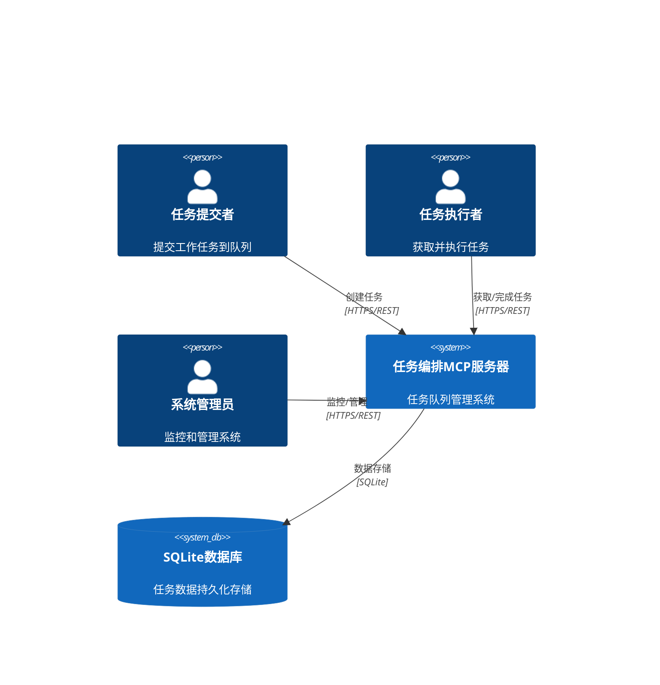
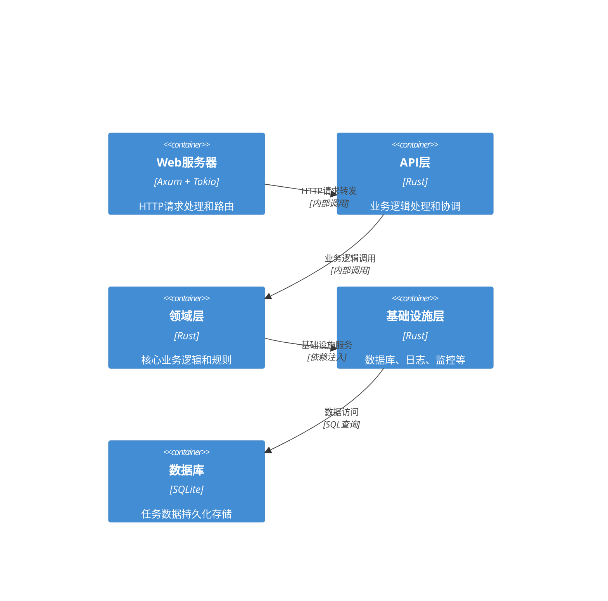

# 任务编排MCP服务器系统架构设计

## 文档信息
- **项目名称**: 任务编排MCP服务器
- **版本**: 1.0.0
- **创建日期**: 2025-08-18
- **最后更新**: 2025-08-18
- **作者**: 系统架构师

## 1. 执行摘要

任务编排MCP服务器是一个基于Rust语言开发的高性能、可靠的任务管理系统。该系统采用清洁架构（Clean Architecture）设计原则，通过分层架构实现高内聚低耦合，支持多客户端并发访问和任务的生命周期管理。

### 1.1 架构目标
- **高性能**: 支持每秒1000个任务处理，响应时间<100ms
- **高可靠**: 99.9%可用性，数据一致性保证
- **高并发**: 支持100个并发连接，防止任务重复获取
- **可扩展**: 支持水平扩展和模块化设计
- **安全**: 完整的认证授权和数据保护机制

### 1.2 核心特性
- 基于SQLite的持久化存储
- 乐观锁并发控制机制
- RESTful API接口设计
- 完整的任务生命周期管理
- 结构化日志和监控指标

## 2. 架构概览

### 2.1 系统上下文



### 2.2 容器架构



## 3. 分层架构设计

### 3.1 清洁架构层次

```
┌─────────────────────────────────────────────────────────────┐
│                     表现层 (Presentation)                    │
│  ┌─────────────────┐  ┌─────────────────┐  ┌─────────────────┐ │
│  │  HTTP路由       │  │  中间件         │  │  请求验证       │ │
│  │  (Axum Router)  │  │  (Middleware)   │  │  (Validation)   │ │
│  └─────────────────┘  └─────────────────┘  └─────────────────┘ │
└─────────────────────────────────────────────────────────────┘
                              │
┌─────────────────────────────────────────────────────────────┐
│                      应用层 (Application)                     │
│  ┌─────────────────┐  ┌─────────────────┐  ┌─────────────────┐ │
│  │  服务接口       │  │  用例协调       │  │  DTO转换        │ │
│  │  (Services)     │  │  (Use Cases)    │  │  (DTOs)         │ │
│  └─────────────────┘  └─────────────────┘  └─────────────────┘ │
└─────────────────────────────────────────────────────────────┘
                              │
┌─────────────────────────────────────────────────────────────┐
│                      领域层 (Domain)                         │
│  ┌─────────────────┐  ┌─────────────────┐  ┌─────────────────┐ │
│  │  聚合根         │  │  值对象         │  │  领域服务       │ │
│  │  (Task Aggregate)│  │  (Value Objects)│  │  (Domain Services)│ │
│  └─────────────────┘  └─────────────────┘  └─────────────────┘ │
└─────────────────────────────────────────────────────────────┘
                              │
┌─────────────────────────────────────────────────────────────┐
│                   基础设施层 (Infrastructure)                 │
│  ┌─────────────────┐  ┌─────────────────┐  ┌─────────────────┐ │
│  │  数据库访问     │  │  日志记录       │  │  监控指标       │ │
│  │  (Repository)   │  │  (Logging)      │  │  (Metrics)      │ │
│  └─────────────────┘  └─────────────────┘  └─────────────────┘ │
└─────────────────────────────────────────────────────────────┘
```

### 3.2 各层职责划分

#### 3.2.1 表现层 (Presentation Layer)
- **职责**: 处理HTTP请求、响应格式化、输入验证
- **组件**: 
  - HTTP路由器 (Axum Router)
  - 请求/响应处理器
  - 中间件 (认证、日志、限流)
  - 请求验证器
- **依赖**: 依赖应用层的服务接口

#### 3.2.2 应用层 (Application Layer)
- **职责**: 协调领域对象、执行用例、事务管理
- **组件**:
  - 应用服务 (TaskService, WorkerService)
  - 用例协调器 (TaskUseCases)
  - DTO (Data Transfer Objects)
  - 事务管理器
- **依赖**: 依赖领域层的聚合根和基础设施层的接口

#### 3.2.3 领域层 (Domain Layer)
- **职责**: 核心业务逻辑、领域规则、数据模型
- **组件**:
  - 聚合根 (Task, TaskHistory)
  - 值对象 (TaskStatus, TaskPriority)
  - 领域服务 (TaskValidationService)
  - 领域事件 (TaskCreated, TaskCompleted)
- **依赖**: 不依赖任何其他层，完全独立

#### 3.2.4 基础设施层 (Infrastructure Layer)
- **职责**: 技术实现、外部集成、基础设施服务
- **组件**:
  - 数据库实现 (SQLite Repository)
  - 日志服务 (Tracing)
  - 监控服务 (Metrics)
  - 配置管理 (Config)
- **依赖**: 实现领域层定义的接口

## 4. 核心组件设计

### 4.1 任务聚合根

```rust
// 领域层 - 任务聚合根
pub struct Task {
    pub id: TaskId,
    pub work_directory: WorkDirectory,
    pub prompt: Prompt,
    pub priority: TaskPriority,
    pub tags: Vec<TaskTag>,
    pub status: TaskStatus,
    pub worker_id: Option<WorkerId>,
    pub created_at: DateTime<Utc>,
    pub started_at: Option<DateTime<Utc>>,
    pub completed_at: Option<DateTime<Utc>>,
    pub result: Option<TaskResult>,
    pub retry_count: u32,
    pub max_retries: u32,
    pub metadata: TaskMetadata,
}

// 领域服务 - 任务业务逻辑
pub struct TaskService {
    task_repository: Arc<dyn TaskRepository>,
    event_publisher: Arc<dyn EventPublisher>,
}
```

### 4.2 并发控制组件

```rust
// 应用层 - 并发控制服务
pub struct ConcurrencyService {
    task_repository: Arc<dyn TaskRepository>,
    lock_manager: Arc<dyn LockManager>,
    retry_policy: RetryPolicy,
}

impl ConcurrencyService {
    pub async fn acquire_task(&self, work_path: &str, worker_id: &str) -> Result<Task> {
        // 使用乐观锁获取任务
        let task = self.task_repository.find_next_task(work_path).await?;
        let acquired = self.lock_manager.try_acquire(&task.id, worker_id).await?;
        
        if acquired {
            self.task_repository.update_task_status(&task.id, TaskStatus::Working).await?;
            Ok(task)
        } else {
            Err(ConcurrencyError::TaskAlreadyAcquired)
        }
    }
}
```

### 4.3 数据访问组件

```rust
// 基础设施层 - 数据库实现
pub struct SqliteTaskRepository {
    pool: Arc<SqlitePool>,
}

#[async_trait]
impl TaskRepository for SqliteTaskRepository {
    async fn create_task(&self, task: &Task) -> Result<TaskId> {
        // 使用事务确保数据一致性
        let mut tx = self.pool.begin().await?;
        
        let result = sqlx::query!(
            "INSERT INTO tasks (task_id, work_directory, prompt, priority, tags, status) 
             VALUES (?, ?, ?, ?, ?, ?)",
            task.id.to_string(),
            task.work_directory.as_str(),
            task.prompt.as_str(),
            task.priority.to_string(),
            serde_json::to_string(&task.tags)?,
            task.status.to_string(),
        )
        .execute(&mut tx)
        .await?;
        
        tx.commit().await?;
        Ok(task.id)
    }
    
    async fn find_next_task(&self, work_path: &str) -> Result<Option<Task>> {
        // 使用乐观锁查询下一个任务
        let task = sqlx::query_as!(
            TaskRecord,
            "SELECT * FROM tasks 
             WHERE work_directory = ? AND status = 'waiting' 
             ORDER BY priority DESC, created_at ASC 
             LIMIT 1 FOR UPDATE SKIP LOCKED",
            work_path
        )
        .fetch_optional(&self.pool)
        .await?;
        
        Ok(task.map(Task::from))
    }
}
```

## 5. 数据架构设计

### 5.1 数据库模式

```sql
-- 任务表
CREATE TABLE tasks (
    id INTEGER PRIMARY KEY AUTOINCREMENT,
    task_id VARCHAR(36) UNIQUE NOT NULL,
    work_directory VARCHAR(512) NOT NULL,
    prompt TEXT NOT NULL,
    priority VARCHAR(10) DEFAULT 'medium' CHECK (priority IN ('low', 'medium', 'high')),
    tags JSON DEFAULT '[]',
    status VARCHAR(20) DEFAULT 'waiting' CHECK (status IN ('waiting', 'working', 'completed', 'failed', 'cancelled')),
    worker_id VARCHAR(100),
    created_at DATETIME DEFAULT CURRENT_TIMESTAMP,
    started_at DATETIME,
    completed_at DATETIME,
    result JSON,
    error_message TEXT,
    retry_count INTEGER DEFAULT 0,
    max_retries INTEGER DEFAULT 3,
    metadata JSON DEFAULT '{}',
    version INTEGER DEFAULT 1,
    updated_at DATETIME DEFAULT CURRENT_TIMESTAMP
);

-- 任务历史表
CREATE TABLE task_history (
    id INTEGER PRIMARY KEY AUTOINCREMENT,
    task_id VARCHAR(36) NOT NULL,
    status VARCHAR(20) NOT NULL,
    worker_id VARCHAR(100),
    changed_at DATETIME DEFAULT CURRENT_TIMESTAMP,
    details JSON DEFAULT '{}',
    FOREIGN KEY (task_id) REFERENCES tasks(task_id) ON DELETE CASCADE
);

-- 系统配置表
CREATE TABLE system_config (
    key VARCHAR(100) PRIMARY KEY,
    value TEXT NOT NULL,
    description TEXT,
    updated_at DATETIME DEFAULT CURRENT_TIMESTAMP
);

-- 性能索引
CREATE INDEX idx_tasks_status_priority ON tasks(status, priority, created_at);
CREATE INDEX idx_tasks_work_directory ON tasks(work_directory, status);
CREATE INDEX idx_tasks_created_at ON tasks(created_at DESC);
CREATE INDEX idx_task_history_task_id ON task_history(task_id, changed_at DESC);
CREATE INDEX idx_tasks_version ON tasks(task_id, version);
```

### 5.2 数据一致性策略

#### 5.2.1 事务管理
```rust
// 应用层 - 事务管理器
pub struct TransactionManager {
    pool: Arc<SqlitePool>,
}

impl TransactionManager {
    pub async fn execute_in_transaction<F, T>(&self, operation: F) -> Result<T>
    where
        F: FnOnce(&mut SqliteConnection) -> Result<T>,
    {
        let mut tx = self.pool.begin().await?;
        let result = operation(&mut tx)?;
        tx.commit().await?;
        Ok(result)
    }
}
```

#### 5.2.2 乐观锁机制
```sql
-- 乐观锁更新语句
UPDATE tasks 
SET status = 'working', 
    worker_id = ?, 
    started_at = CURRENT_TIMESTAMP,
    version = version + 1,
    updated_at = CURRENT_TIMESTAMP
WHERE task_id = ? 
  AND status = 'waiting' 
  AND version = ?
```

### 5.3 数据备份和恢复

```rust
// 基础设施层 - 备份服务
pub struct BackupService {
    database_path: String,
    backup_path: String,
}

impl BackupService {
    pub async fn create_backup(&self) -> Result<String> {
        let timestamp = Utc::now().format("%Y%m%d_%H%M%S");
        let backup_file = format!("{}/backup_{}.db", self.backup_path, timestamp);
        
        // 使用SQLite备份API
        let conn = SqliteConnection::connect(&self.database_path).await?;
        conn.backup(Path::new(&backup_file)).await?;
        
        Ok(backup_file)
    }
    
    pub async fn restore_backup(&self, backup_file: &str) -> Result<()> {
        // 验证备份文件
        self.validate_backup(backup_file).await?;
        
        // 停止服务，恢复数据
        let conn = SqliteConnection::connect(&self.database_path).await?;
        conn.restore(Path::new(backup_file)).await?;
        
        Ok(())
    }
}
```

## 6. API架构设计

### 6.1 RESTful API设计

```rust
// 表现层 - 路由配置
pub fn create_routes() -> Router {
    Router::new()
        .route("/api/v1/tasks", post(create_task).get(list_tasks))
        .route("/api/v1/tasks/next", get(get_next_task))
        .route("/api/v1/tasks/:task_id", get(get_task).put(update_task))
        .route("/api/v1/tasks/:task_id/complete", post(complete_task))
        .route("/api/v1/tasks/:task_id/cancel", post(cancel_task))
        .route("/api/v1/tasks/:task_id/retry", post(retry_task))
        .route("/health", get(health_check))
        .route("/api/v1/statistics", get(get_statistics))
        .layer(
            ServiceBuilder::new()
                .layer(TraceLayer::new_for_http())
                .layer(CompressionLayer::new())
                .layer(SetRequestIdLayer::x_request_id(RequestId::new))
                .layer(TimeoutLayer::new(Duration::from_secs(30)))
        )
}
```

### 6.2 请求/响应模型

```rust
// 应用层 - DTO定义
#[derive(Debug, Serialize, Deserialize)]
pub struct CreateTaskRequest {
    pub work_directory: String,
    pub prompt: String,
    pub priority: Option<TaskPriority>,
    pub tags: Option<Vec<String>>,
}

#[derive(Debug, Serialize, Deserialize)]
pub struct CreateTaskResponse {
    pub task_id: String,
    pub status: TaskStatus,
    pub created_at: DateTime<Utc>,
}

#[derive(Debug, Serialize, Deserialize)]
pub struct ApiResponse<T> {
    pub success: bool,
    pub data: Option<T>,
    pub error: Option<ApiError>,
    pub timestamp: DateTime<Utc>,
}
```

### 6.3 错误处理架构

```rust
// 应用层 - 错误类型定义
#[derive(Debug, Serialize, Deserialize)]
pub enum ApiError {
    ValidationError(ValidationError),
    ConcurrencyError(ConcurrencyError),
    NotFoundError(NotFoundError),
    AuthenticationError(AuthenticationError),
    InternalError(InternalError),
}

// 错误转换中间件
pub async fn error_handler(
    req: Request,
    next: Next,
) -> Result<impl IntoResponse, StatusCode> {
    let result = next.run(req).await;
    
    match result {
        Ok(response) => Ok(response),
        Err(err) => {
            let api_error = match err.downcast::<ApiError>() {
                Ok(api_err) => api_err,
                Err(err) => {
                    error!("Unexpected error: {:?}", err);
                    &ApiError::InternalError(InternalError::new("Internal server error"))
                }
            };
            
            let status = match api_error {
                ApiError::ValidationError(_) => StatusCode::BAD_REQUEST,
                ApiError::ConcurrencyError(_) => StatusCode::CONFLICT,
                ApiError::NotFoundError(_) => StatusCode::NOT_FOUND,
                ApiError::AuthenticationError(_) => StatusCode::UNAUTHORIZED,
                ApiError::InternalError(_) => StatusCode::INTERNAL_SERVER_ERROR,
            };
            
            let response = ApiResponse {
                success: false,
                data: None,
                error: Some(api_error.clone()),
                timestamp: Utc::now(),
            };
            
            Ok((status, Json(response)))
        }
    }
}
```

## 7. 并发控制架构

### 7.1 并发控制策略

```rust
// 应用层 - 并发控制服务
pub struct ConcurrencyController {
    task_repository: Arc<dyn TaskRepository>,
    lock_manager: Arc<dyn LockManager>,
    circuit_breaker: Arc<CircuitBreaker>,
    rate_limiter: Arc<RateLimiter>,
}

impl ConcurrencyController {
    pub async fn acquire_task(&self, request: AcquireTaskRequest) -> Result<Task> {
        // 1. 限流检查
        self.rate_limiter.check_limit(&request.worker_id).await?;
        
        // 2. 熔断器检查
        self.circuit_breaker.call(|| async {
            // 3. 乐观锁获取任务
            self.task_repository
                .acquire_task(&request.work_path, &request.worker_id)
                .await
        }).await
    }
}
```

### 7.2 分布式锁实现

```rust
// 基础设施层 - 分布式锁
pub struct DatabaseLockManager {
    pool: Arc<SqlitePool>,
    lock_timeout: Duration,
}

#[async_trait]
impl LockManager for DatabaseLockManager {
    async fn try_acquire(&self, resource_id: &str, owner_id: &str) -> Result<bool> {
        let expires_at = Utc::now() + self.lock_timeout;
        
        let result = sqlx::query!(
            "INSERT OR IGNORE INTO locks (resource_id, owner_id, expires_at) 
             VALUES (?, ?, ?)",
            resource_id,
            owner_id,
            expires_at,
        )
        .execute(&self.pool)
        .await?;
        
        Ok(result.rows_affected() > 0)
    }
    
    async fn release(&self, resource_id: &str, owner_id: &str) -> Result<()> {
        sqlx::query!(
            "DELETE FROM locks WHERE resource_id = ? AND owner_id = ?",
            resource_id,
            owner_id,
        )
        .execute(&self.pool)
        .await?;
        
        Ok(())
    }
}
```

### 7.3 限流和熔断

```rust
// 基础设施层 - 限流器
pub struct TokenBucketRateLimiter {
    capacity: u32,
    refill_rate: u32,
    tokens: Arc<Mutex<u32>>,
    last_refill: Arc<Mutex<Instant>>,
}

impl RateLimiter for TokenBucketRateLimiter {
    async fn check_limit(&self, key: &str) -> Result<()> {
        let mut tokens = self.tokens.lock().await;
        let mut last_refill = self.last_refill.lock().await;
        
        // 补充令牌
        let now = Instant::now();
        let duration = now.duration_since(*last_refill);
        let refill_amount = (duration.as_secs() as u32 * self.refill_rate) / 60;
        
        if refill_amount > 0 {
            *tokens = (*tokens + refill_amount).min(self.capacity);
            *last_refill = now;
        }
        
        // 检查令牌
        if *tokens > 0 {
            *tokens -= 1;
            Ok(())
        } else {
            Err(RateLimitError::LimitExceeded)
        }
    }
}
```

## 8. 安全架构设计

### 8.1 认证和授权

```rust
// 基础设施层 - 认证中间件
pub struct AuthenticationMiddleware {
    api_key_validator: Arc<dyn ApiKeyValidator>,
}

#[async_trait]
impl Middleware for AuthenticationMiddleware {
    async fn call(&self, req: Request, next: Next) -> Result<Response> {
        // 1. 提取认证信息
        let auth_header = req.headers()
            .get("Authorization")
            .and_then(|h| h.to_str().ok());
        
        let api_key = match auth_header {
            Some(header) if header.starts_with("Bearer ") => {
                &header[7..]
            }
            _ => return Err(AuthenticationError::MissingCredentials.into()),
        };
        
        // 2. 验证API密钥
        self.api_key_validator.validate(api_key).await?;
        
        // 3. 继续处理请求
        Ok(next.run(req).await)
    }
}
```

### 8.2 输入验证和清理

```rust
// 应用层 - 验证服务
pub struct ValidationService {
    path_validator: PathValidator,
    content_validator: ContentValidator,
}

impl ValidationService {
    pub fn validate_create_task_request(&self, request: &CreateTaskRequest) -> Result<()> {
        // 验证工作目录
        self.path_validator.validate_path(&request.work_directory)?;
        
        // 验证prompt内容
        self.content_validator.validate_prompt(&request.prompt)?;
        
        // 验证优先级
        if let Some(priority) = &request.priority {
            self.validate_priority(priority)?;
        }
        
        // 验证标签
        if let Some(tags) = &request.tags {
            self.validate_tags(tags)?;
        }
        
        Ok(())
    }
    
    fn validate_priority(&self, priority: &TaskPriority) -> Result<()> {
        match priority {
            TaskPriority::Low | TaskPriority::Medium | TaskPriority::High => Ok(()),
        }
    }
}
```

### 8.3 数据保护

```rust
// 基础设施层 - 数据脱敏服务
pub struct DataSanitizationService {
    sensitive_patterns: Vec<Regex>,
}

impl DataSanitizationService {
    pub fn sanitize_logs(&self, data: &str) -> String {
        let mut sanitized = data.to_string();
        
        // 脱敏敏感信息
        for pattern in &self.sensitive_patterns {
            sanitized = pattern.replace_all(&sanitized, "***REDACTED***").to_string();
        }
        
        sanitized
    }
    
    pub fn sanitize_response(&self, response: &mut serde_json::Value) {
        // 递归脱敏响应数据
        if let Some(obj) = response.as_object_mut() {
            for (key, value) in obj.iter_mut() {
                if self.is_sensitive_key(key) {
                    *value = serde_json::Value::String("***REDACTED***".to_string());
                } else {
                    self.sanitize_response(value);
                }
            }
        }
    }
}
```

## 9. 性能优化架构

### 9.1 缓存策略

```rust
// 基础设施层 - 缓存服务
pub struct CacheService {
    memory_cache: Arc<Mutex<HashMap<String, CacheEntry>>>,
    config: CacheConfig,
}

impl CacheService {
    pub async fn get(&self, key: &str) -> Option<String> {
        let mut cache = self.memory_cache.lock().await;
        
        if let Some(entry) = cache.get(key) {
            if !entry.is_expired() {
                return Some(entry.value.clone());
            } else {
                cache.remove(key);
            }
        }
        
        None
    }
    
    pub async fn set(&self, key: String, value: String, ttl: Duration) {
        let mut cache = self.memory_cache.lock().await;
        cache.insert(key, CacheEntry::new(value, ttl));
    }
    
    pub async fn cleanup_expired(&self) {
        let mut cache = self.memory_cache.lock().await;
        cache.retain(|_, entry| !entry.is_expired());
    }
}
```

### 9.2 数据库连接池

```rust
// 基础设施层 - 数据库配置
pub struct DatabaseConfig {
    pub url: String,
    pub max_connections: u32,
    pub min_connections: u32,
    pub connection_timeout: Duration,
    pub idle_timeout: Duration,
    pub max_lifetime: Duration,
}

impl DatabaseConfig {
    pub async fn create_pool(&self) -> Result<SqlitePool> {
        let pool = SqlitePoolOptions::new()
            .max_connections(self.max_connections)
            .min_connections(self.min_connections)
            .acquire_timeout(self.connection_timeout)
            .idle_timeout(self.idle_timeout)
            .max_lifetime(self.max_lifetime)
            .connect(&self.url)
            .await?;
        
        Ok(pool)
    }
}
```

### 9.3 异步处理优化

```rust
// 应用层 - 异步任务处理器
pub struct AsyncTaskProcessor {
    task_queue: Arc<TaskQueue>,
    worker_pool: Arc<WorkerPool>,
    semaphore: Arc<Semaphore>,
}

impl AsyncTaskProcessor {
    pub async fn process_tasks(&self) {
        loop {
            // 限制并发处理数量
            let permit = self.semaphore.acquire().await.unwrap();
            
            let task = self.task_queue.pop().await;
            let worker_pool = self.worker_pool.clone();
            
            // 异步处理任务
            tokio::spawn(async move {
                let _permit = permit; // 保持permit直到任务完成
                if let Some(task) = task {
                    if let Err(e) = worker_pool.process_task(task).await {
                        error!("Task processing failed: {:?}", e);
                    }
                }
            });
        }
    }
}
```

## 10. 监控和可观测性架构

### 10.1 结构化日志

```rust
// 基础设施层 - 日志配置
pub fn init_logging() -> Result<()> {
    tracing_subscriber::registry()
        .with(
            tracing_subscriber::EnvFilter::try_from_default_env()
                .unwrap_or_else(|_| "task_orchestrator=info".into()),
        )
        .with(tracing_subscriber::fmt::layer().json())
        .with(tracing_subscriber::fmt::layer().pretty())
        .init();
    
    Ok(())
}

// 使用示例
#[tracing::instrument(skip_all)]
pub async fn create_task_handler(
    req: Request,
    service: Arc<TaskService>,
) -> Result<impl IntoResponse> {
    let span = Span::current();
    span.record("request_id", &req.headers().get("x-request-id"));
    
    info!("Creating new task");
    
    match service.create_task(request).await {
        Ok(task) => {
            span.record("task_id", &task.id.to_string());
            info!("Task created successfully");
            Ok(Json(ApiResponse::success(task)))
        }
        Err(e) => {
            error!("Failed to create task: {:?}", e);
            Err(e)
        }
    }
}
```

### 10.2 指标监控

```rust
// 基础设施层 - 指标收集
pub struct MetricsCollector {
    task_created_counter: Counter,
    task_completed_counter: Counter,
    task_failed_counter: Counter,
    response_time_histogram: Histogram,
    active_tasks_gauge: Gauge,
}

impl MetricsCollector {
    pub fn new() -> Self {
        Self {
            task_created_counter: Counter::new("task_created_total", "Total tasks created"),
            task_completed_counter: Counter::new("task_completed_total", "Total tasks completed"),
            task_failed_counter: Counter::new("task_failed_total", "Total tasks failed"),
            response_time_histogram: Histogram::new("response_time_seconds", "Response time"),
            active_tasks_gauge: Gauge::new("active_tasks", "Number of active tasks"),
        }
    }
    
    pub fn record_task_created(&self) {
        self.task_created_counter.inc();
    }
    
    pub fn record_response_time(&self, duration: Duration) {
        self.response_time_histogram.observe(duration.as_secs_f64());
    }
}
```

### 10.3 健康检查

```rust
// 应用层 - 健康检查服务
pub struct HealthChecker {
    database: Arc<dyn DatabaseHealthChecker>,
    cache: Arc<dyn CacheHealthChecker>,
    external_services: Vec<Arc<dyn ServiceHealthChecker>>,
}

#[derive(Debug, Serialize)]
pub struct HealthStatus {
    pub status: String,
    pub timestamp: DateTime<Utc>,
    pub version: String,
    pub components: HashMap<String, ComponentHealth>,
    pub metrics: SystemMetrics,
}

impl HealthChecker {
    pub async fn check_health(&self) -> HealthStatus {
        let mut components = HashMap::new();
        
        // 检查数据库
        components.insert("database".to_string(), self.database.check_health().await);
        
        // 检查缓存
        components.insert("cache".to_string(), self.cache.check_health().await);
        
        // 检查外部服务
        for service in &self.external_services {
            let health = service.check_health().await;
            components.insert(service.name().to_string(), health);
        }
        
        // 确定整体状态
        let overall_status = if components.values().all(|c| c.healthy) {
            "healthy".to_string()
        } else {
            "unhealthy".to_string()
        };
        
        HealthStatus {
            status: overall_status,
            timestamp: Utc::now(),
            version: env!("CARGO_PKG_VERSION").to_string(),
            components,
            metrics: self.collect_system_metrics(),
        }
    }
}
```

## 11. 部署架构设计

### 11.1 容器化部署

```dockerfile
# Dockerfile
FROM rust:1.70 as builder

WORKDIR /app
COPY . .

# 构建优化
RUN cargo build --release

# 运行时镜像
FROM debian:bullseye-slim

# 安装必要的运行时依赖
RUN apt-get update && apt-get install -y \
    ca-certificates \
    libsqlite3-0 \
    && rm -rf /var/lib/apt/lists/*

# 复制二进制文件
COPY --from=builder /app/target/release/task-orchestrator /usr/local/bin/

# 创建用户
RUN useradd -r -s /bin/false taskuser
USER taskuser

# 健康检查
HEALTHCHECK --interval=30s --timeout=10s --start-period=5s --retries=3 \
    CMD curl -f http://localhost:8080/health || exit 1

# 暴露端口
EXPOSE 8080

# 启动命令
CMD ["task-orchestrator"]
```

### 11.2 Kubernetes部署

```yaml
# deployment.yaml
apiVersion: apps/v1
kind: Deployment
metadata:
  name: task-orchestrator
  labels:
    app: task-orchestrator
spec:
  replicas: 3
  selector:
    matchLabels:
      app: task-orchestrator
  template:
    metadata:
      labels:
        app: task-orchestrator
    spec:
      containers:
      - name: task-orchestrator
        image: task-orchestrator:latest
        ports:
        - containerPort: 8080
        env:
        - name: DATABASE_URL
          value: "sqlite:///data/tasks.db"
        - name: RUST_LOG
          value: "info"
        resources:
          requests:
            memory: "64Mi"
            cpu: "250m"
          limits:
            memory: "128Mi"
            cpu: "500m"
        livenessProbe:
          httpGet:
            path: /health
            port: 8080
          initialDelaySeconds: 30
          periodSeconds: 10
        readinessProbe:
          httpGet:
            path: /health
            port: 8080
          initialDelaySeconds: 5
          periodSeconds: 5
        volumeMounts:
        - name: data
          mountPath: /data
      volumes:
      - name: data
        persistentVolumeClaim:
          claimName: task-orchestrator-pvc
```

### 11.3 系统服务部署

```ini
# systemd服务配置
[Unit]
Description=Task Orchestrator MCP Server
After=network.target
Requires=network.target

[Service]
Type=simple
User=taskuser
Group=taskuser
WorkingDirectory=/opt/task-orchestrator
ExecStart=/opt/task-orchestrator/task-orchestrator
Restart=always
RestartSec=10
StandardOutput=journal
StandardError=journal

# 环境变量
Environment=DATABASE_URL=/var/lib/task-orchestrator/tasks.db
Environment=RUST_LOG=info
Environment=SERVER_PORT=8080

# 安全设置
NoNewPrivileges=true
PrivateTmp=true
ProtectSystem=strict
ProtectHome=true
ReadWritePaths=/var/lib/task-orchestrator
ReadWritePaths=/var/log/task-orchestrator

# 资源限制
LimitNOFILE=65536
MemoryMax=128M

[Install]
WantedBy=multi-user.target
```

## 12. 架构决策记录 (ADR)

### ADR-001: 选择Rust作为开发语言

**状态**: 已接受
**上下文**: 需要选择一种高性能、安全的编程语言
**决策**: 使用Rust语言开发
**后果**: 
- ✅ 内存安全保证
- ✅ 高性能
- ✅ 优秀的并发支持
- ❌ 学习曲线较陡
**替代方案**: Go, Java, Node.js

### ADR-002: 选择SQLite作为数据库

**状态**: 已接受
**上下文**: 需要选择一个轻量级、易部署的数据库
**决策**: 使用SQLite作为主数据库
**后果**:
- ✅ 零配置，易部署
- ✅ 高性能读取
- ❌ 写入并发性有限
**替代方案**: PostgreSQL, MySQL

### ADR-003: 采用清洁架构

**状态**: 已接受
**上下文**: 需要一个可维护、可测试的架构
**决策**: 采用清洁架构设计模式
**后果**:
- ✅ 高内聚低耦合
- ✅ 易于测试
- ✅ 业务逻辑独立
- ❌ 初始开发复杂度较高
**替代方案**: 传统三层架构，微服务架构

### ADR-004: 使用乐观锁进行并发控制

**状态**: 已接受
**上下文**: 需要防止任务被重复获取
**决策**: 使用乐观锁机制
**后果**:
- ✅ 无死锁风险
- ✅ 性能较好
- ❌ 需要重试机制
**替代方案**: 悲观锁，分布式锁

## 13. 性能和扩展性考虑

### 13.1 性能优化策略

1. **数据库优化**:
   - 合理的索引设计
   - 连接池配置
   - 批量操作优化

2. **缓存策略**:
   - 内存缓存热点数据
   - 查询结果缓存
   - 配置缓存

3. **异步处理**:
   - 非阻塞IO操作
   - 并发任务处理
   - 资源池管理

4. **资源管理**:
   - 内存使用优化
   - CPU使用优化
   - 网络资源优化

### 13.2 水平扩展策略

1. **无状态设计**:
   - 应用服务器无状态
   - 会话数据外部化
   - 负载均衡支持

2. **数据分片**:
   - 按工作目录分片
   - 按时间分片
   - 读写分离

3. **缓存层**:
   - 分布式缓存
   - 多级缓存
   - 缓存一致性

### 13.3 容量规划

| 组件 | 基础配置 | 扩展配置 | 限制 |
|------|----------|----------|------|
| 应用服务器 | 2核4G | 4核8G | 16核32G |
| 数据库 | SQLite | PostgreSQL+读写分离 | 分布式数据库 |
| 缓存 | 内存缓存 | Redis集群 | 多级缓存 |
| 并发连接 | 100 | 1000 | 10000 |
| 任务处理 | 1000/秒 | 10000/秒 | 100000/秒 |

## 14. 风险评估和缓解措施

### 14.1 技术风险

| 风险 | 影响程度 | 发生概率 | 缓解措施 |
|------|----------|----------|----------|
| 数据库性能瓶颈 | 高 | 中 | 分库分表、读写分离、缓存优化 |
| 内存泄漏 | 中 | 低 | 内存监控、定期重启、资源限制 |
| 并发控制问题 | 高 | 中 | 充分测试、监控告警、重试机制 |
| 网络延迟 | 中 | 中 | 超时重试、本地缓存、异步处理 |

### 14.2 业务风险

| 风险 | 影响程度 | 发生概率 | 缓解措施 |
|------|----------|----------|----------|
| 任务丢失 | 高 | 低 | 事务保证、备份机制、监控告警 |
| 任务重复执行 | 中 | 中 | 幂等性设计、去重机制 |
| 系统不可用 | 高 | 低 | 高可用部署、故障转移、降级处理 |
| 数据不一致 | 高 | 低 | 事务管理、数据校验、修复机制 |

### 14.3 运维风险

| 风险 | 影响程度 | 发生概率 | 缓解措施 |
|------|----------|----------|----------|
| 部署失败 | 中 | 中 | 自动化部署、回滚机制 |
| 配置错误 | 中 | 中 | 配置验证、配置版本管理 |
| 监控失效 | 中 | 低 | 多重监控、告警机制 |
| 日志丢失 | 低 | 低 | 日志备份、远程日志 |

## 15. 总结

任务编排MCP服务器采用现代化的架构设计，具有以下特点：

### 15.1 架构优势

1. **高性能**: Rust语言 + 异步处理 + 优化的数据库访问
2. **高可靠**: 事务保证 + 错误恢复 + 健康检查
3. **高并发**: 乐观锁 + 连接池 + 资源管理
4. **可扩展**: 清洁架构 + 模块化设计 + 水平扩展
5. **易维护**: 分层架构 + 接口抽象 + 完整文档

### 15.2 关键技术选择

1. **编程语言**: Rust (内存安全、高性能)
2. **Web框架**: Axum (现代、易用)
3. **数据库**: SQLite (轻量、易部署)
4. **架构模式**: 清洁架构 (可维护、可测试)
5. **并发控制**: 乐观锁 (高性能、无死锁)

### 15.3 实施建议

1. **分阶段实施**: 先实现核心功能，再添加高级特性
2. **持续测试**: 单元测试、集成测试、性能测试
3. **监控告警**: 完整的监控体系和告警机制
4. **文档完善**: 架构文档、API文档、运维文档
5. **团队培训**: Rust语言培训、架构设计培训

这个架构设计为任务编排MCP服务器提供了坚实的技术基础，能够满足高性能、高可靠、高并发的业务需求。