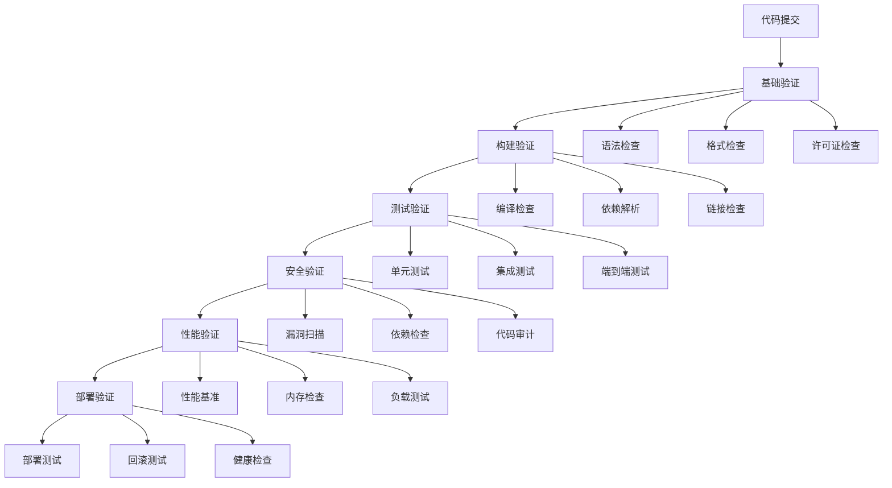
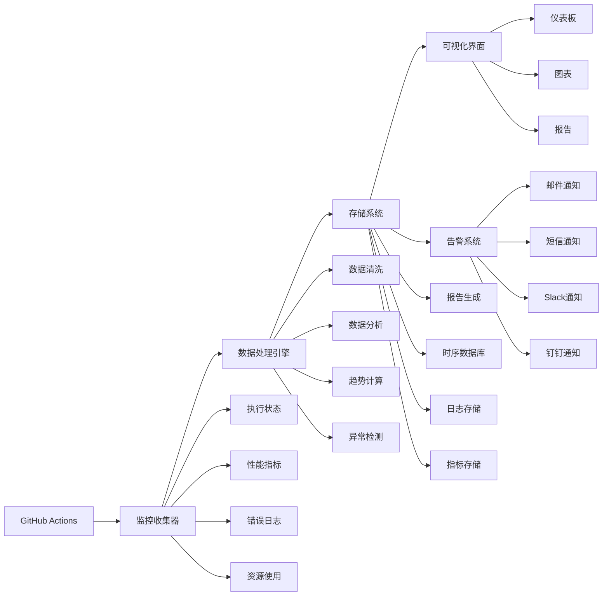

# 验证和监控机制设计

## 1. 自动化验证系统

### 1.1 多层验证架构



### 1.2 验证工作流实现

```yaml
name: Comprehensive Validation

on:
  push:
    branches: [ master, develop ]
  pull_request:
    branches: [ master ]

jobs:
  validation:
    name: Comprehensive Validation
    runs-on: ubuntu-latest
    strategy:
      matrix:
        validation-type: [basic, build, test, security, performance]
      fail-fast: false
    
    steps:
      - name: Checkout repository
        uses: actions/checkout@v4
        with:
          fetch-depth: 1
      
      - name: Setup environment
        uses: ./.github/actions/setup-env
      
      - name: Run basic validation
        if: matrix.validation-type == 'basic'
        uses: ./.github/actions/validate-basic
      
      - name: Run build validation
        if: matrix.validation-type == 'build'
        uses: ./.github/actions/validate-build
      
      - name: Run test validation
        if: matrix.validation-type == 'test'
        uses: ./.github/actions/validate-test
      
      - name: Run security validation
        if: matrix.validation-type == 'security'
        uses: ./.github/actions/validate-security
      
      - name: Run performance validation
        if: matrix.validation-type == 'performance'
        uses: ./.github/actions/validate-performance
      
      - name: Generate validation report
        if: always()
        uses: ./.github/actions/generate-report
        with:
          validation-type: ${{ matrix.validation-type }}
          status: ${{ job.status }}
```

## 2. 监控系统设计

### 2.1 实时监控架构



### 2.2 监控指标定义

#### 2.2.1 执行指标
- **成功率**: 工作流执行成功的比例
- **执行时间**: 各个步骤的执行时间
- **重试次数**: 失败重试的次数
- **队列时间**: 等待执行的时间

#### 2.2.2 性能指标
- **资源使用**: CPU、内存、磁盘使用率
- **网络流量**: 上传/下载流量统计
- **缓存命中率**: 缓存系统的命中率
- **并发数**: 同时运行的作业数量

#### 2.2.3 质量指标
- **测试覆盖率**: 代码测试覆盖率
- **代码质量**: 静态分析结果
- **安全评分**: 安全扫描得分
- **性能评分**: 性能测试得分

### 2.3 监控工作流实现

```yaml
name: Monitoring System

on:
  schedule:
    # 每5分钟运行一次
    - cron: '*/5 * * * *'
  workflow_dispatch:

jobs:
  monitor:
    name: System Monitoring
    runs-on: ubuntu-latest
    
    steps:
      - name: Checkout repository
        uses: actions/checkout@v4
        with:
          fetch-depth: 1
      
      - name: Collect metrics
        run: |
          # 收集GitHub Actions执行数据
          gh run list --limit 100 --json createdAt,status,conclusion,duration --jq . > runs.json
          
          # 收集性能数据
          curl -s "${{ secrets.MONITORING_API_URL }}/metrics" > metrics.json
          
          # 收集系统资源数据
          df -h > disk_usage.txt
          free -h > memory_usage.txt
      
      - name: Analyze metrics
        run: |
          # 分析执行成功率
          success_rate=$(jq '[.[] | select(.conclusion == "success")] | length / length' runs.json)
          echo "Success rate: $success_rate"
          
          # 分析平均执行时间
          avg_duration=$(jq '[.[] | .duration] | add / length' runs.json)
          echo "Average duration: $avg_duration ms"
          
          # 生成监控报告
          cat > monitoring-report.md << EOF
          # Monitoring Report
          
          ## Execution Metrics
          - Success Rate: $success_rate
          - Average Duration: $avg_duration ms
          
          ## System Resources
          - Disk Usage: $(cat disk_usage.txt)
          - Memory Usage: $(cat memory_usage.txt)
          
          ## Generated at: $(date)
          EOF
      
      - name: Check thresholds
        run: |
          # 检查成功率阈值
          if (( $(echo "$success_rate < 0.95" | bc -l) )); then
            echo "❌ Success rate below threshold"
            exit 1
          fi
          
          # 检查执行时间阈值
          if (( $(echo "$avg_duration > 300000" | bc -l) )); then
            echo "⚠️ Average duration above threshold"
          fi
      
      - name: Send alerts
        if: failure()
        uses: 8398a7/action-slack@v3
        with:
          status: failure
          fields: repo,message,commit,author,action,eventName,ref,workflow
          text: 'Monitoring alert: System metrics below threshold'
        env:
          SLACK_WEBHOOK_URL: ${{ secrets.SLACK_WEBHOOK_URL }}
      
      - name: Upload monitoring report
        uses: actions/upload-artifact@v3
        with:
          name: monitoring-report
          path: |
            monitoring-report.md
            runs.json
            metrics.json
            disk_usage.txt
            memory_usage.txt
          retention-days: 7
```

## 3. 告警系统设计

### 3.1 告警规则配置

```yaml
# 告警规则配置
alert_rules:
  # 执行失败告警
  - name: execution_failure
    condition: job.status == 'failure'
    severity: critical
    cooldown: 5m
    notifications:
      - slack
      - email
  
  # 性能退化告警
  - name: performance_degradation
    condition: metrics.duration > metrics.duration_baseline * 1.5
    severity: warning
    cooldown: 15m
    notifications:
      - slack
  
  # 资源不足告警
  - name: resource_exhaustion
    condition: metrics.cpu_usage > 90 || metrics.memory_usage > 90
    severity: critical
    cooldown: 10m
    notifications:
      - slack
      - sms
  
  # 安全漏洞告警
  - name: security_vulnerability
    condition: security.vulnerabilities > 0
    severity: critical
    cooldown: 1h
    notifications:
      - slack
      - email
      - jira
```

### 3.2 告警工作流实现

```yaml
name: Alert System

on:
  workflow_run:
    workflows: ["Comprehensive Validation", "Monitoring System"]
    types: [completed]

jobs:
  alert:
    name: Alert Processing
    runs-on: ubuntu-latest
    if: github.event.workflow_run.conclusion == 'failure'
    
    steps:
      - name: Process alert
        run: |
          # 获取工作流详情
          workflow_id=${{ github.event.workflow_run.id }}
          workflow_name=${{ github.event.workflow_run.name }}
          conclusion=${{ github.event.workflow_run.conclusion }}
          
          # 构建告警消息
          message="🚨 Workflow Alert: $workflow_name failed"
          message="$message\\nWorkflow ID: $workflow_id"
          message="$message\\nConclusion: $conclusion"
          message="$message\\nTime: $(date)"
          
          echo "ALERT_MESSAGE=$message" >> $GITHUB_ENV
      
      - name: Send Slack notification
        uses: 8398a7/action-slack@v3
        with:
          status: failure
          text: ${{ env.ALERT_MESSAGE }}
        env:
          SLACK_WEBHOOK_URL: ${{ secrets.SLACK_WEBHOOK_URL }}
      
      - name: Send email notification
        uses: dawidd6/action-send-mail@v3
        with:
          server_address: ${{ secrets.SMTP_SERVER }}
          server_port: ${{ secrets.SMTP_PORT }}
          username: ${{ secrets.SMTP_USERNAME }}
          password: ${{ secrets.SMTP_PASSWORD }}
          subject: "GitHub Actions Alert: ${{ github.event.workflow_run.name }}"
          body: ${{ env.ALERT_MESSAGE }}
          to: ${{ secrets.ALERT_EMAIL }}
          from: ${{ secrets.SMTP_FROM }}
      
      - name: Create Jira issue
        if: github.event.workflow_run.conclusion == 'failure'
        uses: atlassian/gajira-create@v3
        with:
          project: ${{ secrets.JIRA_PROJECT }}
          issuetype: Bug
          summary: "GitHub Actions Workflow Failure: ${{ github.event.workflow_run.name }}"
          description: ${{ env.ALERT_MESSAGE }}
          fields: |
            {
              "priority": {"name": "High"},
              "labels": ["github-actions", "automated"]
            }
        env:
          JIRA_BASE_URL: ${{ secrets.JIRA_BASE_URL }}
          JIRA_USER_EMAIL: ${{ secrets.JIRA_USER_EMAIL }}
          JIRA_API_TOKEN: ${{ secrets.JIRA_API_TOKEN }}
```

## 4. 报告系统设计

### 4.1 报告生成工作流

```yaml
name: Report Generation

on:
  schedule:
    # 每天凌晨1点生成日报
    - cron: '0 1 * * *'
    # 每周一凌晨2点生成周报
    - cron: '0 2 * * 1'
    # 每月1日凌晨3点生成月报
    - cron: '0 3 1 * *'
  workflow_dispatch:

jobs:
  generate-reports:
    name: Generate Reports
    runs-on: ubuntu-latest
    
    steps:
      - name: Checkout repository
        uses: actions/checkout@v4
        with:
          fetch-depth: 1
      
      - name: Generate daily report
        if: github.event.schedule == '0 1 * * *'
        run: |
          # 获取24小时内的数据
          since=$(date -d '24 hours ago' --iso-8601)
          
          # 生成日报
          gh run list --limit 50 --json createdAt,status,conclusion,duration --jq "[.[] | select(.createdAt >= \"$since\")]" > daily-runs.json
          
          # 分析数据
          total_runs=$(jq length daily-runs.json)
          success_runs=$(jq '[.[] | select(.conclusion == "success")] | length' daily-runs.json)
          success_rate=$(echo "scale=2; $success_runs / $total_runs" | bc)
          
          # 生成日报Markdown
          cat > daily-report.md << EOF
          # Daily Report - $(date +%Y-%m-%d)
          
          ## Summary
          - Total Runs: $total_runs
          - Successful Runs: $success_runs
          - Success Rate: $success_rate
          
          ## Recent Failures
          $(jq -r '[.[] | select(.conclusion != "success")] | .[] | "- \(.workflowName): \(.status)"' daily-runs.json)
          
          ## Performance Metrics
          $(jq -r '[.[] | .duration] | "Average Duration: \(add / length) ms"' daily-runs.json)
          
          Generated at: $(date)
          EOF
      
      - name: Generate weekly report
        if: github.event.schedule == '0 2 * * 1'
        run: |
          # 获取7天内的数据
          since=$(date -d '7 days ago' --iso-8601)
          
          # 生成周报
          gh run list --limit 200 --json createdAt,status,conclusion,duration --jq "[.[] | select(.createdAt >= \"$since\")]" > weekly-runs.json
          
          # 分析数据
          total_runs=$(jq length weekly-runs.json)
          success_runs=$(jq '[.[] | select(.conclusion == "success")] | length' weekly-runs.json)
          success_rate=$(echo "scale=2; $success_runs / $total_runs" | bc)
          
          # 生成周报Markdown
          cat > weekly-report.md << EOF
          # Weekly Report - $(date +%Y-%m-%d)
          
          ## Weekly Summary
          - Total Runs: $total_runs
          - Successful Runs: $success_runs
          - Success Rate: $success_rate
          
          ## Daily Breakdown
          $(jq -r 'group_by(.createdAt[:10]) | .[] | "- \.[0]: \(length) runs, \([.[] | select(.conclusion == "success")] | length) successful"' weekly-runs.json)
          
          ## Top Workflows
          $(jq -r 'group_by(.workflowName) | .[] | "- \.[0]: \(length) runs"' weekly-runs.json)
          
          ## Recommendations
          - Monitor workflows with low success rates
          - Consider optimizing slow-running workflows
          - Review failed workflows for common patterns
          
          Generated at: $(date)
          EOF
      
      - name: Upload reports
        uses: actions/upload-artifact@v3
        with:
          name: reports
          path: |
            daily-report.md
            weekly-report.md
          retention-days: 30
      
      - name: Commit reports to repository
        run: |
          git config --local user.email "action@github.com"
          git config --local user.name "GitHub Action"
          git add reports/
          git commit -m "Add automated reports $(date +%Y-%m-%d)" || exit 0
          git push
```

## 5. 质量保证机制

### 5.1 质量门禁

```yaml
name: Quality Gate

on:
  pull_request:
    branches: [ master ]
  push:
    branches: [ master ]

jobs:
  quality-gate:
    name: Quality Gate Check
    runs-on: ubuntu-latest
    
    steps:
      - name: Checkout repository
        uses: actions/checkout@v4
        with:
          fetch-depth: 1
      
      - name: Check test coverage
        run: |
          # 安装tarpaulin进行覆盖率测试
          cargo install cargo-tarpaulin
          
          # 运行覆盖率测试
          cargo tarpaulin --out Xml --output-dir coverage
          
          # 检查覆盖率是否达到阈值
          coverage=$(python3 -c "
          import xml.etree.ElementTree as ET
          tree = ET.parse('coverage/cobertura.xml')
          root = tree.getroot()
          coverage = float(root.get('line-rate')) * 100
          print(coverage)
          ")
          
          if (( $(echo "$coverage < 80" | bc -l) )); then
            echo "❌ Test coverage $coverage% is below threshold 80%"
            exit 1
          fi
          
          echo "✅ Test coverage $coverage% meets threshold"
      
      - name: Check code quality
        run: |
          # 运行clippy检查
          cargo clippy --all-targets --all-features -- -D warnings
          
          # 检查代码格式
          cargo fmt --all -- --check
          
          echo "✅ Code quality checks passed"
      
      - name: Check performance regression
        run: |
          # 运行性能基准测试
          cargo bench --bench '*' --save-baseline baseline
          
          # 比较性能结果
          cargo bench --bench '*' --baseline baseline
          
          echo "✅ Performance regression check completed"
      
      - name: Check security compliance
        run: |
          # 运行安全审计
          cargo audit --deny warnings
          
          echo "✅ Security compliance check completed"
      
      - name: Generate quality report
        run: |
          cat > quality-report.md << EOF
          # Quality Gate Report
          
          ## Test Coverage: $coverage%
          ## Code Quality: ✅ Passed
          ## Performance: ✅ Passed
          ## Security: ✅ Passed
          
          ## Generated at: $(date)
          EOF
      
      - name: Upload quality report
        uses: actions/upload-artifact@v3
        with:
          name: quality-report
          path: quality-report.md
          retention-days: 30
```

## 6. 实施建议

### 6.1 分阶段实施
1. **第一阶段**: 基础监控和告警
2. **第二阶段**: 高级验证和质量门禁
3. **第三阶段**: 自动化报告和优化
4. **第四阶段**: 智能分析和预测

### 6.2 技术栈选择
- **监控**: Prometheus + Grafana
- **日志**: ELK Stack
- **告警**: Alertmanager + Slack
- **存储**: TimescaleDB + InfluxDB

### 6.3 维护策略
- 定期更新监控规则
- 优化告警阈值
- 扩展监控指标
- 改进报告格式

---

这个验证和监控机制设计提供了完整的系统监控解决方案，确保GitHub Actions的稳定运行和持续改进。